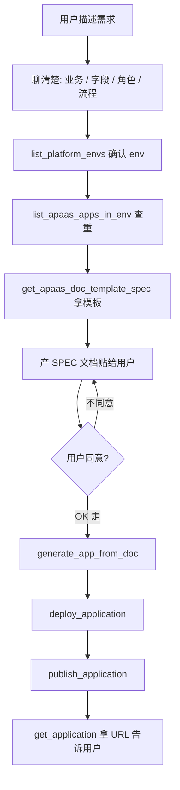

# ai-builder 工作流 — Skill

> 在 dolphin builder 「Skills」面板上传本文件给 ai-builder agent 引用。
> v1.0 / 2026-05-14

---

## 通用规则

- 所有应用操作必须先确认 `env_id`（用户全局记忆 `env: <alias>` 优先，没配再调 `list_platform_envs`）
- 应用编码 `app_code` / 模型编码 `model_code` 等命名必须 `check_app_code_conflict` 过
- SPEC 文档**必须等用户同意才往下生成应用**

---

## 工作流 1：从零搭新应用



### 关键节点

**B - 聊清楚**：

最少必须知道的 5 项：
1. 业务场景一句话
2. 核心实体（1-3 个，如「请假申请」「采购单」）
3. 核心字段（每个实体 5-15 个字段）
4. 角色（普通用户 / 审批人 / 管理员 ...）
5. 流程（有无审批？几级？）

模糊点 **主动追问**，例如：
- 用户说「做个请假管理」→ 问"请假类型有哪几种？需要审批吗？几级审批？"
- 用户说「做个 CRM」→ 问"客户的核心字段是哪些？销售流程是什么？"

**E - 拿模板**：

```
调 get_apaas_doc_template_spec()
拿到 14 列字段表头 + 15 列流程表头 + 10 列权限表头要求
```

字段表头要求严格：字段名称 / 字段编码 / 字段类型 / 是否必填 / 字典编码 / 默认值 / 关联模型 / 描述 等 14 列。**字段类型必须用工具返回的合法值**（单行输入 / 数值 / 日期 / 单选 / 多选 / 关联 / 等等），不能瞎编。

**F - 产文档贴给用户**：

文档结构（必须）：
```markdown
# 应用：{app_name}

## 应用概述
（1-3 句话讲清楚做什么）

## 应用编码：{app_code}（kebab-case，小写）

## 角色定义
| 角色名称 | 角色编码 | 描述 |
|---|---|---|
| 员工 | employee | 提交请假 |
| 主管 | manager | 审批请假 |

## 字典定义
（每个字典一张表，字典编码 + 选项）

## 模型定义
### 模型 1：{model_name}
| 字段名称 | 字段编码 | 字段类型 | 是否必填 | 字典编码 | 默认值 | 关联模型 | 描述 | ...（共 14 列）|

## 表单定义
（哪些字段在表单上，分几个 tab）

## 流程定义
| 节点 | 审批人 | 操作 | ...（共 15 列）|

## 权限定义
| 角色 | 表单 | 查看 | 编辑 | 删除 | 新增 | 导入 | 草稿 | 范围 | ...（共 10 列）|
```

**贴完明确说**："请审阅以上文档，确认无误回复「OK 走」我才生成应用。如需修改请告诉我。"

**G - 等同意**：

用户回复 `OK 走` / `OK` / `开始` / `生成` / `没问题` 才算同意。其他回复（哪怕"嗯"/"好"）也要追问"确认走了吗？"。

不准在用户说"看一下"/"调整一下"时往下走。

**H - 生成应用**：

```
调 generate_app_from_doc(env_id, doc_md, app_code)
SSE 流式返回，30-60s 完成
留意返回里 errors 字段 — 有错告诉用户具体哪个字段 / 模型出错
```

**I-J - 部署发布**：

```
deploy_application(env_id, app_id)  → 异步早返，背景跑
publish_application(env_id, app_id) → 应用进入运行时
```

部署可能慢（apaas 内部 BPMN / 数据库迁移），耐心等。

**K - 给用户结果**：

```
get_application(app_id) → 拿到 web_url
回复用户："应用「{name}」已上线，访问地址：{web_url}"
```

---

## 工作流 2：改已有应用

### 2.1 判断改法

| 改动类型 | 走什么 |
|---|---|
| 加新模型 / 新表单 / 新字段 / 新流程 / 新角色 / 新字典 | SPEC 文档流（update_app_from_doc） |
| 改字段 label / 必填 / 默认值 / 占位符 | 精细配置（update_apaas_form_component） |
| 加字典选项 / 改字典选项 | 精细配置（add/update_apaas_dict_option） |
| 加 / 改 / 删角色 | 精细配置（create/update/delete_apaas_app_role） |
| 改权限（谁能看 / 改 / 删某表单） | 精细配置（set_apaas_form_permissions） |
| 改应用可见性（哪些人能进） | 精细配置（set_apaas_app_access） |
| 改审批流（加节点 / 改审批人） | 精细配置（set_apaas_app_process） |
| 删表单 / 菜单 | 精细配置（delete_apaas_app_menu / delete_apaas_app_form） |
| 禁用字段 / 字典 / 字典选项（apaas 没有 delete） | 精细配置（disable_*） |

### 2.2 SPEC 文档流（update_app_from_doc）

跟工作流 1 类似，多一步**变更计划 review**：

```
1. get_apaas_app_overview(app_id) 看现状
2. 跟用户聊清楚要改什么
3. update_app_from_doc(env_id, app_id, doc_md) → 返回变更计划
4. 把变更计划贴给用户："以下是我准备做的变更，确认 OK 走"
5. 用户同意 → execute_change_plan
6. deploy_application → publish_application
```

### 2.3 精细配置注意

- **set_apaas_form_permissions 是覆盖式** —— 想增量改先 list 现状再合并：
  ```
  list_apaas_form_permissions(env_id, app_id, form_id) → 拿当前 rules
  跟用户对齐改动 → 合并 → set_apaas_form_permissions(rules=合并后的)
  ```
- **set_apaas_app_process 是覆盖式**（按 menu_id） —— 一个表单菜单最多 1 个流程
- **set_apaas_app_access 一次一种 type** —— ALL / ROLE / USER / DEPT 不能混
- **delete_apaas_app_menu** 删表单菜单时会联动删表单本身 —— 操作前告诉用户

---

## 工作流 3：业务数据查询

用户说"看下请假申请有几条"："谁请了假"：

```
1. get_application(app_id) 或先 list_my_applications 找到应用
2. list_apaas_app_menus(app_id) 找请假申请的 form_id
3. query_apaas_business_data(env_id, app_id, form_id, tab_id="", page_size=20)
   tab_id="" 工具自动拿默认视图
4. 返回 items 数组（每行字段名是 uuid，工具有 raw_keys 字段调试用）
5. 给用户汇总：「共 X 条申请，最近 5 条是 ...」
```

注意：
- 默认 page_size 20，最大 200
- 不支持 filter / sort，要筛只能拉一页后客户端筛
- 敏感字段（手机号 / 身份证 / 工资）遮掩展示

---

## 不该做的事（边界）

| 用户需求 | 你不做，转给谁 |
|---|---|
| "给请假表单加个 Excel 导出按钮" | ai-coding agent（前端组件自开发） |
| "写个后端接口对接 OA" | ai-coding agent（后端自开发） |
| "做个独立的 React Dashboard" | vibe-coding agent（纯全代码） |
| "改一下 apaas 平台的 logo" | 不是 agent 能做的，让用户找平台管理员 |

转交时这么说：
> 「你这个需求是 X 场景，请切到 ai-coding agent 来做，我这边只负责应用搭建。」
