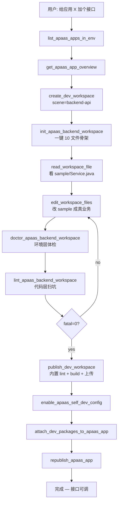
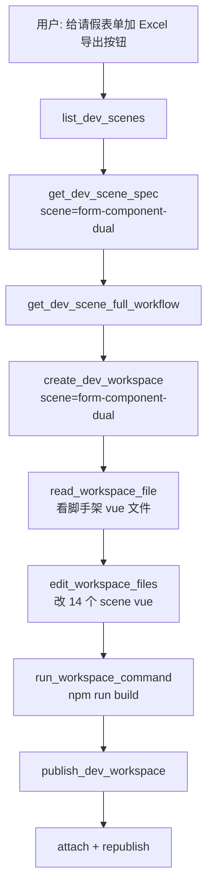

# ai-coding 工作流 — Skill

> v1.0 / 2026-05-14
> 给 ai-coding agent 引用。详细 16 坑速查见 `backend-dev.md`。

---

## 总览：三大工作流

```
┌─────────────────────────────────────┐
│ A. 后端接口自开发 (backend-api)     │
│ B. 前端组件自开发 (form-component, │
│    dashboard, custom-page 等)        │
│ C. 看板自开发 (dashboard 子集)       │
└─────────────────────────────────────┘
```

---

## 工作流 A：后端接口自开发



### A.1 init 骨架

```
init_apaas_backend_workspace(
  ws_id=...,
  project_name="leave-export",      # kebab-case
  apaas_app_id="824710872671715328",
  apaas_tenant_id="1",
  sample_form_id="<从 list_apaas_app_menus 拿>"
)
```

写入 10 文件：
- `pom.xml` (papaas 4.1.1-rc + motor 1.2.8 + lib/single profile)
- `src/main/java/com/xdap/leave_export/common/BasePojo.java`（系统字段基类）
- `src/main/java/com/xdap/leave_export/common/dao/BaseDao.java`
- `src/main/java/com/xdap/leave_export/config/LeaveExportUrlAllowConfig.java`
- `src/main/java/com/xdap/leave_export/sample/{entity,service,controller}/...`
- `src/test/java/com/xdap/leave_export/LeaveExportApplication.java` ← **必须 test 路径**
- `src/main/resources/application.properties`
- `README.md`（16 坑速查）

### A.2 改业务

照 sample 改：

```java
// 1. 加 Entity
@Table(value = "leave_apply")
public class LeaveApplyEntity extends BasePojo {  // 必须继承 BasePojo
    @Column(value = "applicant")
    private String applicant;
    // ...
}

// 2. 改 Service
public Map<String, Object> exportLeaveApplies() {
    return baseDao.query()
        .sql("SELECT * FROM leave_apply WHERE tenant_id = :tid")
        .setOriginVar("tid", tenantId == null ? "" : tenantId)  // 坑 13: null 兜底
        .doQuery();   // 无参版本，坑 9
}

// 3. 改 Controller
@PostMapping("/export")
public Response export(@RequestBody Map<String, Object> req) {
    return Response.ok().setData(service.exportLeaveApplies());
}
```

### A.3 自查 + 发布

```
doctor → lint → publish_dev_workspace（内置 lint，fatal=0 才让走）
publish 成功后再：
  enable_apaas_self_dev_config(app_id, status="ENABLE")
  attach_dev_packages_to_apaas_app(app_id, kit_id, kit_type="BACKEND")
  republish_apaas_app(app_id)
```

### A.4 联调

接口路径：`/apaas/backend/model/{app_code}/custom/{project_name}/export`
- 外部测试用 Postman 配 `xdaptoken` + `xdaptimestamp` 头
- aPaaS 前端按钮事件配 `this.$request({...Api.EXPORT, params:{...}})`

---

## 工作流 B：前端组件自开发



### B.1 9 个支持的场景（list_dev_scenes 返回）

| scene_type | 说明 |
|---|---|
| `form-component-dual` | 表单字段组件（双端 PC+移动）— 14 个 scene vue + setting + widget config |
| `form-component-pc` | 表单组件（仅 PC） |
| `form-page` | 自开发表单页 |
| `form-list` | 自开发列表页 |
| `mobile-page` | 移动端自开发页面 |
| `login-page` | 自定义登录页 |
| `dashboard` | 看板组件 |
| `custom-page` | 任意自开发页面 |
| `backend-api` | 后端接口（走工作流 A） |
| `backend-feign` | 后端 Feign 调用 |
| `backend-scheduled` | 后端定时任务 |

### B.2 关键铁律（前端）

- **Vue 2.7** 不是 3
- **Element UI 已全局注册** — 不要 `import 'element-ui'`
- 私有 npm 源：`https://registry.dfy.definesys.cn/repository/apaas-npm-group/`
- 日期用 `this.$dayjs`，工具用 `this.$lodash`
- **`console.log` 在生产构建被剥离** — 调试用 `console.info`
- **网络请求用 `this.$request`** —— **body 走 `params` 不是 `data`**（坑过 N 次）
- 表单数据查询用 `Api.QUERY_LIST` → `/xdap-app/business/v2/query/listPageBusinessData`，必传 `formId + tabId + selectorFilterConditionList + filterConditionGroup + orders + type`

### B.3 例：form-page 业务数据查询

```vue
<template>
  <el-table :data="rows">
    <el-table-column prop="applicant" label="申请人" />
  </el-table>
</template>

<script>
export default {
  data() {
    return { rows: [], formId: this.formId, tabId: this.tabId };
  },
  async mounted() {
    this.$request({
      url: '/xdap-app/business/v2/query/listPageBusinessData',
      method: 'POST',
      params: {                                  // ⭐ 不是 data
        formId: this.formId,
        tabId: this.tabId,
        page: 1, pageSize: 50,
        selectorFilterConditionList: [],
        filterConditionGroup: [],
        orders: [],
        type: 'initialize',
      },
    }).asyncThen((res) => { this.rows = res.data; })
      .asyncErrorCatch((err) => console.info('list err', err));
  }
};
</script>
```

---

## 工作流 C：看板自开发

走 B.1 里 scene_type=`dashboard`，剩下跟 B 一致。

看板特殊点：
- `<dashboard-component>` 组件 props 已经被宿主注入，不用自己声明 formId / appId
- 数据查询同样用 `Api.QUERY_LIST` + `params`
- 多个看板 widget 在一个 zip 包里，每个 widget 一个目录 + 一份 `widget.config.json`

---

## 发布 / 上传 / 挂载链路（A / B / C 通用）

`publish_dev_workspace` 内部做完整链路：

```
1. mvn package -P lib（后端）或 npm run build → df-apaas-cli build（前端）
   构建失败 → 调 _summarize_build_failure 拿分类 error_code 给 agent
2. 把 jar / zip 上传到 aPaaS 平台资源池
   返回 kit_id（kit_type=BACKEND/FRONTEND）
3. 应用关联（enable_self_dev_config + attach + republish 三连）
   有的版本 publish_dev_workspace 内置完成，没的话手动调
```

如果 `publish_dev_workspace` 报 build 失败：

| error_code | 怎么修 |
|---|---|
| `MVN_AUTH_FAIL` | 调 doctor 看 settings.xml；缺 dcloud-public 认证 |
| `MVN_DEPS_RESOLVE_FAIL` | 调 doctor 看 pom <repositories> + settings.xml |
| `MVN_PROFILE_NOT_FOUND` | pom 缺 lib profile → 重新 init |
| `MVN_JDK_MISMATCH` | JAVA_HOME 切 JDK 8（papaas 模版包 Java 8） |
| `MVN_COMPILE_FAIL` | 先调 lint 看代码层错 |
| `FE_COMPILE_FAIL` | 看 npm build 日志，多半 eslint / TS 错 |

---

## 边界：哪些不该你做

| 用户需求 | 转给谁 |
|---|---|
| "加个字段 / 改字段 label" | ai-builder（精细配置） |
| "做个新应用" | ai-builder（应用生成） |
| "改审批流" | ai-builder（set_apaas_app_process） |
| "做个独立 React Dashboard 项目，跟 aPaaS 无关" | vibe-coding（纯全代码） |
| "改 aPaaS 平台 logo / 导航" | 不是 agent 能做 |
