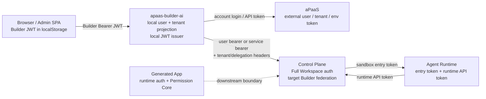

# Builder 租户与鉴权全景

**状态**：现状基线 v0.1
**基线日期**：2026-07-17
**主工程**：`apaas-builder-ai`
**关联工程**：`control-plane`、`agent-runtime`、`app-seed`、`web-console`

## 1. 文档目的

本文固定 Builder 租户与鉴权链路的当前事实，作为后续优化、迁移和回归测试的共同基线。

本文严格区分四种状态：

- **Current**：当前代码真实执行的路径。
- **Transitional**：为兼容或迁移同时保留的路径。
- **Target**：已确认设计中的目标路径，但尚未成为当前事实。
- **Deprecated**：已声明废弃，不应被新能力继续依赖的路径。

本文不把以下概念混为一谈：

- Authentication：调用者是谁。
- Tenant resolution：当前请求属于哪个租户。
- Authorization：该身份在当前租户能做什么。
- Resource isolation：数据查询和写入是否真正受租户约束。
- Credential delegation：下游服务代表谁、用什么凭据调用。

## 2. 全景结论

Builder 当前不是单一鉴权体系，而是五个信任域叠加：



当前主事实是：

1. 浏览器主登录态仍是 `apaas-builder-ai` 自签的 Builder JWT。
2. Builder JWT 的 `tid` 是 Builder API 当前租户上下文的主要来源。
3. Builder 本地维护用户、租户、成员、角色和权限投影。
4. aPaaS、Control Plane 的用户 token 和环境凭据被投影或保存到 Builder 本地。
5. Builder 调 Control Plane 时同时存在用户 Bearer、全局 service token 和受信 delegation headers。
6. Agent Runtime 已形成相对独立的 entry token / runtime API token 双令牌边界。
7. 2026-07-11 联邦认证目标要求统一为 Control Plane 用户 token，但 `/api/builder-auth/**` 尚未成为当前实现主线。

因此，第一优先级不是继续增加登录分支，而是先确定身份权威、租户权威和令牌职责的唯一契约。

## 3. 身份与租户 ID 词汇表

### 3.1 用户标识

| 标识 | 当前字段或来源 | 当前用途 | 状态 |
| --- | --- | --- | --- |
| Builder local user ID | `users.id`、JWT `sub` | Builder 数据归属、会话、项目、成员关系 | Current |
| aPaaS user ID | `users.apaas_user_id`、JWT `apaas_sub` | aPaaS 身份映射、MCP 和 API 调用 | Current |
| Control Plane user ID | `users.coding_user_id` | Control Plane 身份映射、Workspace 打开 | Transitional |
| Username | `users.username` | 展示、历史匹配和部分跨系统绑定 | Transitional |
| External binding ID | 目标 `ExternalIdentityBinding.bindingId` | 稳定联邦绑定事实 | Target |

当前 `users` 表把本地身份投影、外部身份引用和多类凭据放在同一行，且稳定外部 ID 没有形成完整唯一约束体系。

### 3.2 租户标识

| 标识 | 当前字段或来源 | 当前用途 | 状态 |
| --- | --- | --- | --- |
| Builder local tenant ID | `tenants.id`、JWT `tid` | Builder 数据隔离主键 | Current |
| aPaaS tenant ID | `tenants.apaas_tenant_id_str`、JWT `apaas_tid` | aPaaS 环境与租户映射 | Current |
| aPaaS environment | `tenants.apaas_env_id -> platform_envs.id` | aPaaS 地址、账号、token、自愈登录 | Current |
| Control Plane tenant ID | `users.coding_tenant_id` 或 `tenant_code=workspace-*` | Control Plane 请求 `X-Tenant-Id` | Transitional |
| Request tenant header | Control Plane `X-Tenant-Id` | Control Plane 请求级 tenant 校验 | Current in Control Plane |
| Builder request tenant header | 目标 `X-Builder-Tenant-Id` | Builder 请求级 tenant 选择 | Target |

当前同一个业务租户可能同时由本地 ID、aPaaS ID、Control Plane ID 和环境 ID 表达，映射关系分散在 `User`、`Tenant`、`PlatformEnv` 和命名约定中。

## 4. 当前认证链路

### 4.1 Browser -> Builder

```text
login/select/switch
  -> Builder backend
  -> create_access_token()
  -> JWT {sub, tid, type=access, apaas_sub?, apaas_tid?}
  -> browser localStorage.token
  -> Authorization: Bearer <builder-jwt>
  -> get_auth_context()
```

关键事实：

- Browser token 存在 `localStorage`。
- 普通请求不发送 `X-Builder-Tenant-Id`。
- tenant switch 会重新签发带新 `tid` 的 Builder JWT，然后整页 reload。
- `get_auth_context()` 对平台管理员允许缺少 tenant，并可回退到默认成员租户。
- `mcp_service` token 在解析后投影为 `platform_admin + {"*": true}`。

证据：

- `backend/app/auth.py`
- `backend/app/deps.py`
- `backend/app/routes/auth/login.py`
- `frontend/src/stores/user.ts`
- `frontend/src/utils/request.ts`

### 4.2 aPaaS login -> Builder projection

```text
aPaaS username/password
  -> platform-admin probe + backend login
  -> aPaaS user/tenant discovery
  -> upsert Builder User/Tenant/UserTenant/Role projection
  -> save APaaS platform/user/environment credentials
  -> optional Control Plane token exchange
  -> issue Builder JWT
```

当前会保存或更新：

- `users.apaas_token`
- `apaas_platform_credentials`
- `apaas_user_credentials`
- `platform_envs.username/password_enc/token`
- `users.coding_access_token/coding_refresh_token`

这是身份投影、租户投影和凭据托管耦合最重的路径。

### 4.3 Control Plane account -> Builder projection

当前 Builder 兼容路径调用 Dolphin/Control Plane 兼容认证 API，读取当前用户后：

- 以 `coding_user_id` 或 `username + account_source` 查找本地用户。
- 把 Control Plane access/refresh token 加密保存到 `users`。
- 根据显式环境绑定或 `workspace-{tenantId}` 命名规则创建本地租户成员关系。
- 最终仍签发 Builder JWT 给浏览器。

这意味着 Control Plane token 当前是下游调用材料，不是 Browser -> Builder 的主会话 token。

### 4.4 Builder -> Control Plane

Builder 调 Control Plane 时存在三种模式：

| 模式 | 凭据 | 身份语义 | 状态 |
| --- | --- | --- | --- |
| 用户 Bearer | 用户行中的 Control Plane access token | 最终用户 | Current / Transitional |
| 全局 Bearer | `dolphin_code_control_plane_token` | Builder service/admin | Transitional |
| Delegation headers | shared secret + delegated user/tenant headers | service 代表用户 | Transitional |

Control Plane 当前默认认证链是：

```text
Authorization Bearer
  -> TokenAuthenticationFilter
  -> Full Workspace AuthGateway
  -> X-Tenant-Id validation
  -> CurrentUserContext + TenantContext
```

2026-07-11 目标要求新增独立 `/api/builder-auth/**` 和
`X-Auth-Provider: builder-control-plane` 路由。当前 Control Plane 链路分析仍将其列为待实现。

### 4.5 Builder -> Agent Runtime

该链路分为三层：

1. Builder embed token：短期 iframe 能力票。
2. Builder proxy cookie：绑定 Builder user/tenant/session。
3. Agent Runtime entry token：由 Control Plane/runtime contract 管理。

Agent Runtime 内部另有 runtime API token，用于 heartbeat、destroy 和 entry token rotate。两类 token 已分离，不应重新合并。

### 4.6 Builder -> aPaaS API

租户绑定的 `PlatformEnv` 是 aPaaS API 会话的主要运行时来源：

- `base_url`
- `platform_tenant_id`
- `username`
- `password_enc`
- `token`

`call_apaas_with_relogin()` 在 token 失效时使用环境账号密码重新登录并重试一次。

这条链路表达的是外部平台环境凭据，不应与最终用户 Browser session 混用。

## 5. 当前授权模型

Builder 当前授权由以下层次组成：

| 层次 | 事实源 | 当前行为 |
| --- | --- | --- |
| 平台管理员 | `users.is_platform_admin` | 大量路由直接放行，通常拥有 `{"*": true}` |
| 租户角色 | `user_tenants.role_id -> roles` | 解析为 tenant_admin/developer/viewer/member |
| 组织权限 | `roles.permissions` JSON | 前后端按权限 code 判断 |
| 资源归属 | 各表 `tenant_id`、`user_id` | 由各业务查询自行约束 |
| MCP service | token type `mcp_service` | 当前被投影为平台管理员权限 |
| 生成应用权限 | `app-seed` Permission Core | 属于下游应用运行态，不是 Builder 管理端权限事实源 |

主要问题不是完全没有权限控制，而是平台管理员短路、角色 JSON、资源查询约束、service token 和未来 Permission Core 尚未收敛为一致的决策模型。

## 6. 现状、过渡和目标差异

| 主题 | Current | Target | 差距 |
| --- | --- | --- | --- |
| Browser 主 token | Builder JWT | 明确的 Builder session 或 Control Plane 用户 token 契约 | 尚未冻结 |
| 当前 tenant | Builder JWT `tid` | 请求级显式 tenant，逐请求校验 | Builder 仍依赖重签 JWT |
| 联邦绑定事实 | Builder 本地字段和匹配逻辑 | Auth SDK/Provider `ExternalIdentityBinding` | Provider 能力未落地 |
| Control Plane auth API | 兼容 `/api/auth/**` 调用 | `/api/builder-auth/**` | 未成为当前代码路径 |
| Provider 路由 | 单一 Full Workspace AuthGateway | `X-Auth-Provider` 单路 fail-closed | 未实现 |
| 外部凭据 | 分散在 User/Credential/Env/Project | 独立 credential vault/ref | 未收敛 |
| 平台管理员 tenant | 可默认或跨租户 | 显式选择、请求级审计 | 存在 ambient tenant |
| Workspace 用户代理 | service token + headers | 用户 token 优先，delegation 严格限域 | 兼容路径仍多 |
| 前端 token 存储 | localStorage | HttpOnly/BFF 或更窄暴露面 | 尚未迁移 |

## 7. 主要风险清单

### P0：身份权威未唯一

Builder 本地 JWT、aPaaS 身份、Control Plane 身份和未来 Auth Provider 同时承担部分权威职责。若继续局部优化，容易出现登录成功但 tenant、role、token issuer 不一致的状态。

### P0：凭据集中且职责混杂

`users`、aPaaS credential 表、`PlatformEnv` 和 `Project` 都可能保存 token、账号或密码。`control_plane` token 读取还兼容未加密历史值。身份主数据和凭据生命周期没有独立边界。

### P0：平台管理员存在隐式租户

平台管理员 token 可缺少 tenant，并回退默认成员租户；部分页面还可回退系统第一个 active tenant。平台级身份与租户级业务上下文没有强制分离。

### P1：跨系统租户映射依赖启发式规则

Control Plane tenant 可能来自 `tenant_code=workspace-*`、`users.coding_tenant_id` 或 aPaaS 环境绑定。映射没有单一实体和唯一约束。

### P1：用户调用与 service delegation 并存

Builder 调 Control Plane 可使用用户 token、全局 token 或 delegation headers。若调用点选择不一致，审计主体、权限主体和资源 owner 可能漂移。

### P1：service token 权限过宽

Builder `mcp_service` token 当前直接得到平台管理员权限。应把 token type、允许 endpoint、允许 operation 和 tenant 绑定拆开校验。

### P1：浏览器 token 暴露面较大

Builder 和 Admin SPA 都从 `localStorage` 读取 token。当前没有统一 refresh/logout/revoke 会话模型，也没有按设备或会话隔离。

### P1：远端身份到本地角色的自动推导较多

登录流程会根据平台管理员探测、远端租户列表、用户名、环境账号和角色偏好自动更新本地成员与角色。登录和授权配置副作用耦合。

### P2：历史资源缺 tenant 时存在兼容放行

部分旧 workspace 缺少 `tenant_id` 时按 `user_id` 兜底。该兼容应有迁移完成条件和最终删除时间点。

### P2：测试多但缺少跨域验收矩阵

当前有较多 auth/tenant 单测，但仍缺：

- 两种 provider 的完整 login/refresh/revoke/disable 矩阵。
- 用户、平台管理员、tenant admin、service identity 的 endpoint 权限矩阵。
- Builder/aPaaS/Control Plane 三类 tenant ID 的一致性验证。
- 并发 tenant switch、旧 token、旧 cookie 和 runtime session 的失效验证。
- 真实 Provider token 和真实 tenant membership 的 live E2E。

## 8. 优化前必须冻结的安全不变量

1. 每个请求只能有一个最终用户身份权威。
2. 每个 tenant-scoped 请求必须有一个显式、已验证的 tenant。
3. 外部用户和租户必须使用稳定 ID 绑定，username 只能用于首次候选匹配。
4. 用户业务请求不得回退到全局 service/admin token。
5. service token 必须限制 audience、token type、tenant、operation 和 endpoint。
6. 平台管理员身份不自动等于任意租户的 active context。
7. 请求 body、query 和 LLM/tool 参数中的 user/tenant 不得成为身份事实源。
8. token、密码和 refresh token 不进入普通业务实体和日志。
9. token refresh、revoke、账号禁用和 tenant membership 失效必须 fail closed。
10. 任何历史兼容放行都必须有可统计的迁移指标和删除门槛。

## 9. 证据索引

### Builder

- `backend/app/auth.py`
- `backend/app/deps.py`
- `backend/app/models/__init__.py`
- `backend/app/models/tenant.py`
- `backend/app/routes/auth/login.py`
- `backend/app/routes/auth/tenants_admin.py`
- `backend/app/builder_auth/settings.py`
- `backend/app/code_runtime/auth.py`
- `backend/app/code_runtime/service.py`
- `backend/app/routes/code_runtime.py`
- `backend/app/apaas_session.py`
- `frontend/src/stores/user.ts`
- `frontend/src/utils/request.ts`
- `admin-spa/src/api/client.ts`

### Control Plane

- `../control-plane/src/main/java/com/orcamatrix/controlplane/auth/infrastructure/security/TokenAuthenticationFilter.java`
- `../control-plane/src/main/java/com/orcamatrix/controlplane/auth/infrastructure/security/SecurityConfiguration.java`
- `../control-plane/src/main/java/com/orcamatrix/controlplane/common/context/CurrentUserContext.java`
- `../control-plane/src/main/java/com/orcamatrix/controlplane/workspace/interfaces/WorkspaceOpenController.java`
- `../control-plane/docs/solutions/l3/auth/builder-federated-auth-chain-analysis.md`
- `../control-plane/docs/phases/2026-07-11-builder-federated-auth-control-plane.md`

### Agent Runtime

- `../agent-runtime/internal/application/runtime_auth.go`
- `../agent-runtime/internal/http/auth.go`
- `../agent-runtime/internal/http/runtime_auth_handlers.go`
- `../agent-runtime/docs/solutions/l3/sandbox-runtime/runtime-api-heartbeat-auth-token-split.md`

### 目标设计

- `docs/superpowers/specs/2026-07-11-builder-control-plane-apaas-federated-auth-design.md`
- `docs/superpowers/plans/2026-07-09-builder-ai-unified-auth.md`
- `docs/superpowers/specs/2026-07-12-apaas-tenant-environment-binding-design.md`
