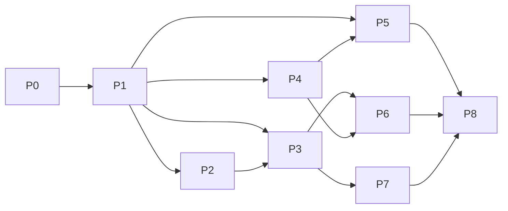

# Builder 租户与鉴权优化路线图

**状态**：Active
**创建日期**：2026-07-17
**现状基线**：`docs/solutions/l1/arch/builder-tenant-auth-panorama.md`

## 1. 目的与范围

本路线图用于逐步收敛 Builder 的身份、租户、授权、凭据和运行时信任边界。

覆盖：

- `apaas-builder-ai`
- `control-plane`
- `agent-runtime`
- 与生成应用 Permission Core 的边界

不覆盖：

- 在未冻结权威模型前直接重写登录页。
- 一次性替换全部历史 token 和租户数据。
- 把生成应用运行时权限模型直接套到 Builder 管理端。
- 用 service token 或平台管理员兜底来换取迁移速度。

## 2. 状态定义

| 状态 | 含义 |
| --- | --- |
| Future | 尚未进入详细设计 |
| Planned | 范围和依赖已明确 |
| Ready | Spec、迁移和验收输入已齐 |
| In Progress | 正在分析或实现 |
| Done | 验收证据完整且兼容路径已处理 |

## 3. 阶段总览

| Phase | 主题 | 状态 | 主要结果 |
| --- | --- | --- | --- |
| P0 | 全景与证据基线 | In Progress | 当前链路、ID、token、风险和测试矩阵 |
| P1 | 权威模型与安全不变量冻结 | Planned | 身份权威、tenant 权威、token taxonomy 决策 |
| P2 | 身份投影与凭据边界 | Future | 稳定 external binding、credential ref/vault |
| P3 | 请求级租户上下文统一 | Future | 显式 tenant、逐请求校验、去除 ambient tenant |
| P4 | Control Plane Builder federation | Future | `/api/builder-auth/**`、Provider router、SDK binding |
| P5 | Builder 浏览器会话收敛 | Future | session/refresh/revoke、减少 localStorage 暴露 |
| P5-A | 统一账号 refresh 跨系统提交恢复 | Planned | issuer 幂等重取、SDK 透传、Builder pending operation |
| P6 | Workspace 与 Runtime delegation 加固 | Future | 用户调用优先、service identity 限域 |
| P6-A | 沙箱 token-free 与无感续期安全切片 | Ready | entry token 不落库/浏览器、跨浏览器隔离、透明续期 |
| P7 | Builder 管理端授权收敛 | Future | 角色、权限资源、guard、审计统一 |
| P8 | 数据迁移、兼容删除与真实 E2E | Future | 删除启发式映射和旧 token 路径 |

## 4. P0：全景与证据基线

**目标**

把当前所有身份、tenant、token、credential、permission 和 runtime trust path 拉成可复核清单。

**范围**

- 建立现状全景。
- 建立 token registry。
- 建立跨系统 ID mapping 表。
- 建立 endpoint auth/tenant/permission matrix。
- 统计历史兼容数据和凭据分布。
- 标注 Current/Transitional/Target/Deprecated。

**非目标**

- 不修改登录和租户切换行为。
- 不迁移数据库。
- 不删除任何兼容路径。

**验收**

- 每类 token 都有 issuer、holder、storage、audience、tenant binding、TTL、refresh、revoke 和 consumer。
- 每个 tenant-scoped endpoint 都能说明 tenant 来源和资源约束。
- 每个跨服务调用都能说明最终用户、service identity 和审计主体。
- 设计文档与当前代码冲突被显式列出。

**主要产物**

- `docs/solutions/l1/arch/builder-tenant-auth-panorama.md`
- 后续补充 `docs/solutions/l2/auth/token-registry.md`
- 后续补充 `docs/solutions/l2/auth/endpoint-access-matrix.md`
- 后续补充 `docs/solutions/l3/auth/legacy-data-audit.md`

## 5. P1：权威模型与安全不变量冻结

**目标**

先决定“谁是最终身份权威、谁是 tenant 权威、Browser 持有什么 token”，再进入实现。

**范围**

- 冻结 Browser -> Builder session contract。
- 冻结 Builder -> Control Plane user token contract。
- 冻结 aPaaS external identity binding contract。
- 冻结 tenant request contract。
- 定义 token taxonomy 和 fail-closed 行为。
- 定义平台管理员进入租户上下文的显式流程。

**非目标**

- 不在该阶段实现完整 SDK federation。
- 不同步重构所有业务 endpoint。

**验收**

- 一个流程中不存在两个并列最终身份权威。
- tenant switch 不再同时拥有互相冲突的 JWT/header/session 语义。
- service token 不允许替代用户业务请求。
- 2026-07-09 与 2026-07-11 两份方案的冲突有明确裁决。

**依赖**

- P0 完成。
- Auth SDK/Provider 能力现状确认。

## 6. P2：身份投影与凭据边界

**目标**

把用户身份投影、外部绑定和凭据生命周期从 `users` 普通业务行中拆开。

**范围**

- 引入稳定 external identity binding。
- 为 aPaaS/Control Plane user ID 和 tenant ID 建立唯一约束。
- 引入 credential ref/vault 抽象。
- 迁移 `coding_access_token`、`coding_refresh_token`、`apaas_token`。
- 收敛 `APaaSPlatformCredential`、`APaaSUserCredential`、`PlatformEnv` 和 Project 凭据重复。

**非目标**

- 不在同一阶段改完所有前端 session 行为。

**验收**

- 用户业务表不保存 refresh token。
- 不再以 username 作为后续登录绑定事实。
- 凭据 revoke、rotate、过期和 owner 可独立审计。
- 历史明文兼容读取有统计和删除门槛。

**依赖**

- P1 完成。

## 7. P3：请求级租户上下文统一

**目标**

让每个 tenant-scoped 请求都显式携带并验证 tenant，移除隐式默认和命名启发式。

**范围**

- Builder 请求引入明确 tenant header/session contract。
- 将 JWT `tid` 从唯一真源降为兼容输入或移除。
- 平台管理员必须显式选择 tenant 后才能访问 tenant 业务数据。
- 建立 Builder tenant、aPaaS tenant、Control Plane tenant 的映射实体。
- 清理 `workspace-*` tenant code 推导。
- 迁移缺少 `tenant_id` 的 workspace 和历史记录。

**非目标**

- 不改变 Agent Runtime entry/runtime token 分离。

**验收**

- 无 tenant 的 tenant-scoped 请求 fail closed。
- 平台管理员不会自动落到系统第一个 tenant。
- 目标资源 tenant 与请求 tenant 必须一致。
- 旧 workspace user-only fallback 可删除。

**依赖**

- P1 完成。
- P2 至少完成稳定 ID 和映射模型。

## 8. P4：Control Plane Builder federation

**目标**

实现已确认的 Builder 专用认证门面和 Provider 单路路由。

**范围**

- `/api/builder-auth/**`
- `BuilderAuthGateway`
- `X-Auth-Provider: builder-control-plane`
- aPaaS exchange/bind/revoke
- Control Plane tenant membership validation
- Provider error mapping and audit

**非目标**

- 不恢复 deprecated `/api/auth/**` 登录主线。
- 不在 Control Plane 自建外部身份绑定表。

**验收**

- Full Workspace 和 Builder token 不互相回退。
- Provider 不可用返回稳定 503。
- 非法 tenant 返回稳定 403。
- refresh、revoke、账号禁用和 membership 失效均 fail closed。
- SDK contract test 和真实 provider smoke 均通过。

**依赖**

- P1 完成。
- Auth SDK/Provider 达到 Federation Ready 和 Tenant Access Ready。

## 9. P5：Builder 浏览器会话收敛

**目标**

明确 Browser 持有的会话材料，补齐 refresh、revoke、设备/会话隔离和安全退出。

**范围**

- 决定 HttpOnly BFF session 或短 access token 模型。
- 移除 `admin_token`/`token` 双 storage 语义。
- 登录、刷新、退出、失效、重新认证统一。
- tenant 切换不依赖整页重签 token 才能保证隔离。
- SSE/download/embed 使用窄 capability token。

**验收**

- refresh token 不暴露给 Browser JavaScript。
- logout/revoke 后旧 token、cookie 和 embed capability 全部失效。
- Admin SPA 与主 Builder 共用同一会话事实。
- XSS 风险下的长期 token 暴露面显著降低。

**依赖**

- P1 完成。
- P4 接口可用，或 P1 明确选择独立 Builder BFF session。

### P5-A：统一账号 refresh 跨系统提交恢复

**目标**

关闭一次性 refresh token 已在 issuer 轮换、但 Builder 保存新凭据失败后无法
重取结果的窗口。

**范围**

- 锁定真实 refresh issuer、Admin SDK/Provider 源仓库和唯一调用路径。
- issuer 按 idempotency key 重取同一次 token pair。
- Control Plane adapter/SDK 透传幂等键。
- Builder 在远端调用前持久化 pending refresh operation。
- 故障注入验证远端成功、本地提交失败后的恢复。

**非目标**

- 不与 P6-A 的 Runtime session、entry token 或 iframe proxy 改造混在一个 Spec。

**验收**

- 相同 refresh operation 不会发生第二次 token 轮换。
- Builder 崩溃或提交失败后可重取同一结果并完成本地凭据更新。
- issuer、SDK、Control Plane 和 Builder 的所有者及仓库路径已明确。

**依赖**

- P4 的最终 Builder refresh 调用路径冻结。
- Auth SDK/Provider 支持或接受幂等 refresh contract。

## 10. P6：Workspace 与 Runtime delegation 加固

**目标**

区分最终用户调用、Builder service 调用和 Runtime service 调用，消除权限主体漂移。

**范围**

- Control Plane 用户 Bearer 优先。
- delegation 仅保留无法直接转发用户 token 的窄场景。
- 生产环境默认关闭 local delegation debug。
- shared secret 升级为可轮换 service identity。
- `mcp_service` token 增加 audience、endpoint 和 operation allowlist。
- 保持 Agent Runtime entry token/runtime API token 双边界。

**验收**

- 用户业务动作的审计主体始终是最终用户。
- service identity 不能访问未授权 tenant 或 endpoint。
- runtime token 不能被 Browser 使用。
- entry token 不能调用 runtime control API。

**依赖**

- P3 完成 tenant 统一。
- P4/P5 明确用户 token 传递方式。

### P6-A：沙箱 token-free 与无感续期安全切片

该切片因直接消除 entry token 落库、浏览器暴露和可恢复超时用户可见错误，按
安全热路径提前设计和实施。它只复用已经确认的“Control Plane 用户/平台租户
权威、平台租户可绑定 aPaaS 租户”结论，不表示 P1 全量完成，也不解锁 P6 其他
delegation 改造。

**范围**

- `docs/superpowers/specs/2026-07-17-builder-sandbox-token-free-transparent-renewal-design.md`
- 复用 Builder 已加密保存的 Control Plane access/refresh token。
- 复用现有 authenticated `workspace/open` 和 Runtime query-token bootstrap。
- 增加 Runtime session TTL、浏览器会话隔离和透明续期。
- 按 L1-L4 分级验证，并包含真实 Chromium + Firefox 同账号并发。

**门禁**

- 不新增 renewal grant 或宽权限 service delegation。
- 统一账号 refresh、账号、租户或 workspace 权限失效时 fail closed。
- 远端 refresh 轮换成功但 Builder 本地提交失败的恢复由 P5-A 负责，不在本切片
  宣称无感。
- 本切片完成不能作为 P2-P5 或 P6 其余范围的依赖完成证明。

## 11. P7：Builder 管理端授权收敛

**目标**

把平台管理员短路、tenant role、JSON permission、资源归属和未来 Permission Core 接入整理为统一决策层。

**范围**

- 建立 Builder 管理端 permission resource/operation registry。
- 对危险读和写操作增加后端 guard。
- 前端权限只用于展示，不作为安全事实。
- 平台管理员、tenant admin、developer、viewer 和 service identity 建立矩阵。
- 明确 Builder 管理端权限与 generated app Permission Core 的边界。

**验收**

- 每个 authenticated management endpoint 有稳定 operation ID。
- 每个写操作有后端 permission decision。
- 资源 owner/tenant guard 与角色权限同时生效。
- 权限决策、拒绝和管理员跨租户操作可审计。

**依赖**

- P3 完成。
- Permission Core consumer phase 契约明确。

## 12. P8：迁移、兼容删除与真实 E2E

**目标**

完成数据迁移、双写/读旧切换、兼容删除和真实环境验收。

**范围**

- 外部 ID 和 tenant mapping 数据回填。
- 凭据迁移与旧字段清零。
- 删除 username 后续匹配、`workspace-*` 映射和 user-only tenant fallback。
- 删除 deprecated auth API 依赖。
- 建立真实账号、真实 token、真实 tenant、真实 runtime E2E。

**验收**

- 无活动请求依赖旧路径。
- 所有兼容指标达到删除门槛。
- 跨 tenant 负向测试全通过。
- provider revoke、membership revoke、token rotate 和 runtime reopen 全链路通过。
- rollback 不需要恢复明文凭据或放宽鉴权。

**依赖**

- P2-P7 完成。

## 13. 依赖图

## 14. 并行化说明

- P2 的数据模型设计可与 P4 的 SDK contract spike 并行，但正式实现都必须服从 P1。
- P3 的 Builder tenant contract 可与 Control Plane tenant validation 测试补齐并行。
- P5 前端 session 设计可提前做威胁建模，但不能在 P1 前确定最终 token 形态。
- P7 endpoint inventory 可在 P0 开始收集，guard 实现应等 P3 tenant 语义稳定。

## 15. 首批可执行切入点

下一轮优先完成 P0 的三个小产物：

1. Token Registry：列出所有 token/cookie/secret 的完整生命周期。
2. Endpoint Access Matrix：覆盖 Builder auth、tenant、admin、MCP、Code runtime 和 Control Plane workspace API。
3. Legacy Data Audit：统计 users/tenants/workspaces 中外部 ID、明文兼容 token、缺 tenant 和启发式映射数据。

这三个产物完成后，再进入 P1 的权威模型决策，不直接开始大规模代码重构。

## 16. 维护规则

- 新增 auth/tenant 方案必须引用本路线图和现状全景。
- 实现事实变化后先更新全景，再更新阶段状态。
- 单元测试通过不能替代真实 provider/tenant E2E。
- 兼容路径只能在有指标、owner 和删除条件时保留。
- 任一阶段发现身份或 tenant 事实源重新分叉时，停止下游实现并回到 P1 修订。
