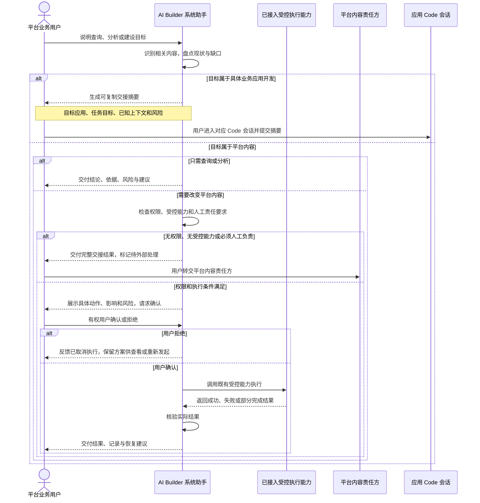

# 系统助手统一纳管平台功能与内容 · 功能大纲

> **业务目标**：平台负责人、工程标准负责人和环境运营人员在 AI Builder 现有系统助手中，通过对话完成平台内容的查询、分析、方案设计、经确认后的处理和结果交付，不再依赖到处翻找资料或少数人的经验。
> **当前状态**：业务方向已确认；v0.9 已通过独立 PRD Review，待用户查看；首批执行动作、实现映射和开发排期尚未冻结。

## 当前结论

本期把 AI Builder 现有系统助手建设为平台内容的统一对话、受控调用和结果核验入口。用户只需说明要了解、规划或处理的事情，系统助手就应识别相关平台内容，给出基于当前事实的结论和方案。涉及改变现状时，系统助手先检查用户权限、受控执行能力是否已接入，以及是否必须由人工责任方处理；条件满足后，才向有权用户展示具体动作、影响和风险并请求确认。

系统助手不是内容责任方本人。无权限、没有受控执行能力或必须由责任人处理时，它不进入执行确认，直接交付包含责任人、输入、步骤、风险和完成标准的交接结果，并明确标记为“待外部处理”。用户拒绝确认时则反馈“已取消执行”并保留方案，既不标记为待外部处理，也不宣称完成变更。

这里的“纳管”不是把所有内容搬进一个新系统，也不是接管原来的维护责任。它对业务意味着：分散的种子工程、能力、Skill、知识、环境和其他平台基础，可以从同一个对话入口被找到、被说明、被比较、被规划，并在权限和确认边界内被处理；原有权威来源、归属和责任人保持不变。

## 一次平台工作如何完成



系统助手对“完成”的判断不是已经回答过，而是用户拿到了可继续使用的结果：已核验的处理成果，或者状态明确为“待外部处理”的完整交接结果。用户拒绝时，当前任务停在“已取消执行”，保留方案供后续查看或重新发起。应用开发场景本期只交付可复制摘要；是否进入 Code 会话以及后续开发结果由用户和对应应用会话负责。

## 系统助手实际负责什么

| 用户任务 | 系统助手的责任 | 完成标志 |
| --- | --- | --- |
| 查询 | 找到用户有权查看的相关内容，说明现状、来源和可用程度 | 用户能判断“有什么、在哪里、能否使用” |
| 分析 | 比较现状与目标，识别复用机会、缺口、冲突和风险 | 用户获得有依据的判断，而非笼统建议 |
| 方案设计 | 给出处理步骤、影响范围、责任分工和需要确认的动作 | 方案可以被决定、转交或继续细化 |
| 执行条件检查 | 在请求确认前检查用户权限、受控执行能力和人工责任要求 | 只有权限和执行条件满足时才进入确认 |
| 确认与取消 | 向有权用户展示具体动作、影响和风险；拒绝时不执行并保留方案 | 拒绝结果为“已取消执行”，可查看或重新发起 |
| 经确认后处理 | 权限和执行条件已满足，且有权用户明确确认后，调用既有受控执行能力 | 系统助手核验并如实反馈成功、失败或部分完成 |
| 外部处理交接 | 无执行能力、权限不足或必须人工负责时，不请求执行确认，直接明确责任人、输入、步骤、风险和完成标准 | 结果标记为“待外部处理”，不冒充已完成 |
| 应用开发交接 | 识别具体业务应用开发边界，生成包含目标应用、任务目标、已知上下文和风险的可复制摘要 | 用户可自行进入对应应用 Code 会话继续 |
| 结果交付 | 交付核验结果或完整交接结果，说明成果位置、遗留问题和恢复建议 | 下一位责任人无需重新询问上下文即可继续 |

## 纳管对象与业务结果

| 对象 | 纳管后业务人员能完成什么 | 责任边界 |
| --- | --- | --- |
| 种子工程 | 了解适用场景和准备情况，形成新项目起点方案；确认后通过已接入能力完成支持的创建、登记或更新 | 不假定固定技术栈；具体项目开发仅生成摘要，由用户进入应用 Code 会话 |
| 能力 | 查询能力用途、使用条件和当前可用性，比较是否适合复用，形成补齐方案 | 不把“已登记”视为“已可用”，无法验证时明确标注 |
| Skill | 了解解决的问题、适用范围、维护归属和发布状态，形成创建或更新方案 | 创建、更新和发布需明确确认，且只能通过已接入受控能力执行 |
| 知识 | 查找权威内容及适用范围，识别缺失、重复或过期内容，提出维护建议 | 不把本地缓存或无法证明归属的内容冒充权威来源 |
| 环境 | 查看有权访问的环境现状和风险，形成检查、写入或启停方案 | 写入和启停需明确确认；无能力或无权限时交付待外部处理结果 |
| 其他平台基础 | 对模板、治理规则、工程与工作区等已接入内容提供同样的查询、分析、设计、处理和交付闭环 | 未接入或无法判断的内容如实说明，不用推测补全 |

这些对象仍由各自权威来源和责任方维护。系统助手提供统一对话、受控调用、结果核验和交接标准，不新建影子资产目录，也不替代内容责任方履责。

## 本期范围与非目标

| 判断 | 本期边界 | 说明 |
| --- | --- | --- |
| 本期范围 | 入口仅为 AI Builder 现有系统助手 | 本期不新增入口；用户通过自然对话发起工作 |
| 本期范围 | 覆盖查询、分析、方案设计、执行条件检查、确认后处理和结果交付 | 权限和执行条件满足后才请求确认；确认后调用受控能力并核验结果 |
| 本期范围 | 统一纳管种子工程、能力、Skill、知识、环境及其他平台基础 | 各对象保持原有权威位置、归属和维护责任 |
| 本期范围 | 为具体应用开发生成可复制交接摘要 | 仅包含目标应用、任务目标、已知上下文和风险，由用户自行进入对应 Code 会话 |
| 本期非范围 | Web Console 入口 | 后续可增加，但本期不设计、不改造、不迁移 |
| 本期非范围 | 具体业务应用的代码开发 | 不自动创建或打开 Code 会话，不自动携带上下文，不执行 Bug 修复、接口或页面改动 |
| 本期非范围 | 未经确认的高风险动作 | 创建、更新、发布、Git 推送、环境写入、启停和删除均不得自动执行 |
| 本期非范围 | 绕过现有权限或替代内容责任方 | 系统助手不能因入口统一而扩大用户权限或改变数据归属 |
| 后续能力 | 应用 Code 会话自动联动 | 自动创建或打开会话、受控携带上下文、触发对应会话执行等能力留待后续设计，本期不承诺 |

## 风险与需要决定

| 事项 | 业务影响 | 当前处理 | 是否需要用户决定 |
| --- | --- | --- | --- |
| 内容来源未接入、过期或不可用 | 查询结论可能不完整，处理无法继续 | 标记无法判断、过期或待接入，交付影响和补齐路径 | 否 |
| 执行能力未接入、权限不足或需人工负责 | 任务不能由系统助手直接处理 | 不请求执行确认，直接交付完整结果并标记“待外部处理” | 否 |
| 无权用户的表达被误当作确认 | 可能绕过权限并造成未经授权的变更 | 先校验权限；无权用户的动作不构成有效确认，任务进入“待外部处理” | 否 |
| 高风险动作被误解为默认授权 | 可能造成发布、环境或资产变更 | 条件满足后展示具体动作、影响和风险，再由有权用户明确确认 | 否；这是执行时确认，不是本版新增业务确认 |
| 用户拒绝后状态不清 | 可能被误认为仍待他人处理或已经完成 | 不执行，反馈“已取消执行”，保留方案供查看或重新发起 | 否 |
| 平台工作与应用开发混淆 | 工作进入错误会话，交付责任不清 | 识别边界并生成可复制摘要，由用户进入对应应用 Code 会话 | 否 |
| 首批执行动作和实现范围未冻结 | UI、技术和测试不能直接承诺完整实现与排期 | 独立评审后再形成实现映射、首批清单和开发计划 | 否，当前不提前决定 |

**当前无需新增确认。** 业务方向、入口、非目标和高风险确认原则已经明确；待进入实现准备时，再决定首批具体执行动作及排期。

## 关联文件

| 文件 | 用途 | 当前关系 |
| --- | --- | --- |
| [本功能大纲](2026-08-20-system-assistant-platform-entry-design.md) | 定义统一纳管的业务含义、用户流程、对象、范围和风险 | 当前权威 PRD，v0.9 已通过独立评审，待用户查看 |
| [Code 系统助手 P0 技术方案](../../solutions/l1/architecture/code-system-assistant.md) | 提供现有会话、安全、来源和运行边界 | revision 1.0 技术基线；本 PRD 只消费边界，不复制实现细节 |

<details>
<summary>供 UI、技术与测试继续使用的功能大纲合同</summary>

### 下游必须保持的产品含义

| 消费方 | 可继续的设计工作 | 本阶段不得自行改变 |
| --- | --- | --- |
| UI | 区分事实结论、待确认方案、受控执行结果、“待外部处理”交接和可复制的应用开发摘要 | 不增加入口，不呈现自动打开、携带上下文或执行应用开发的假能力 |
| 技术 | 映射内容来源、受控执行能力、权限、确认、调用反馈和结果核验 | 不让系统助手替代内容责任方，不实现应用 Code 会话自动创建、打开、携带上下文或执行 |
| 测试 | 按条件检查、确认或交接、受控执行与核验主线设计首批场景 | 验证无权确认无效；无执行条件直接待外部处理；拒绝为已取消；确认后覆盖成功、失败和部分完成 |

### 进入详细设计前仍需补齐

- 首批纳管对象各自支持到“查询、分析、方案、处理、交付”的哪一层。
- 每个可执行动作的权限来源、确认内容、成功标准和失败恢复方式。
- 每类外部交接的责任人、必要输入和完成标准，以及应用 Code 会话自动创建、打开、携带上下文和触发执行的后续范围。
- UI 承载、实现映射和可执行验收场景。

这些内容尚未冻结，不在功能大纲阶段提前展开字段字典、接口、技术架构、逐页交互或详细验收矩阵。

</details>

## 质量与评审状态

| 检查 | 结论 | 说明 |
| --- | --- | --- |
| 作者完整性检查 | 完成 | 业务结果、角色流程、对象、范围、风险和下游边界已对齐 |
| 独立 PRD Review | 已通过 | v0.8 reviewer findings 为空；v0.9 仅同步状态，不代表实现范围确认、用户确认或开发授权 |
| 业务方向 | 已确认 | 当前无需新增确认；实现范围与排期未冻结 |

<details>
<summary>作者自检</summary>

- [x] 默认视图先回答解决什么、谁如何使用、系统助手负责到哪里，以及范围、风险和关联文件。
- [x] “纳管”已用可判断的业务结果解释，并明确不改变权威来源、内容归属和维护责任。
- [x] 一张跨角色业务流区分受控能力执行、待外部处理交接和用户自行进入应用 Code 会话；文字未逐节点重复图示。
- [x] 种子工程、能力、Skill、知识、环境和其他平台基础均落到用户任务与责任边界，没有堆叠技术接口。
- [x] AI Builder 唯一入口、Web Console 非目标、应用 Code 会话边界和高风险动作确认原则均保留且未扩大。
- [x] 系统助手未被描述为内容责任方；只有受控能力已接入、用户有权且已确认时才执行并核验。
- [x] 权限、受控能力和人工责任要求先于执行确认；无权用户的动作不构成有效确认。
- [x] 无执行条件时直接交付“待外部处理”；用户拒绝时反馈“已取消执行”并保留方案，两种状态不混淆。
- [x] 应用开发本期只生成可复制摘要，自动创建、打开、携带上下文和执行均明确为非范围或后续能力。
- [x] 当前只达到功能大纲成熟度；未提前设计字段、接口、技术架构、逐页交互和详细验收矩阵。
- [x] 当前无需新增业务确认；首批执行动作、实现映射和开发排期仍明确为后续工作。

</details>

<details>
<summary>版本与来源审计</summary>

- 本版变化：v0.9 仅同步独立 PRD Review 已通过状态；v0.8 reviewer findings 为空，未修改业务含义。
- 影响范围：流程、范围、风险、来源和下游边界均不变；独立评审通过不等于实现范围确认、用户确认或开发授权。
- 来源限制：v0.5 已在同一路径被原位覆盖，且未保留可回读的独立快照，因此不能作为可核验正式来源；本版改为记录实际非文件用户决定，不把作者摘要冒充来源。

```yaml
source_refs:
  - document_id: ARCH-20260809-002-code-system-assistant-p0
    revision: '1.0'
    canonical_path: docs/solutions/l1/architecture/code-system-assistant.md
    consumed_sections: [P0 增量边界与事实源, 工具与工作区安全边界, 只读基线来源与失败语义, P1/P2 延迟范围、回滚与验证]
    sha256: b8083a30de70d0b445c8a1e32b9952812731f88de99b51d139b42368420126be
    use_summary: 消费平台对象类别、权威来源、组织与工作区安全、高风险操作和后续阶段边界；实现细节不复制进业务正文。
non_file_sources:
  - source_id: USER-DECISION-20260820-001
    source_type: conversation_decision
    revision: original
    sequence: 1
    original_statement: 入口这个在思考下，其他的没问题
    use_summary: 用户当时仅保留入口选择待思考，其他已讨论业务方向没有提出异议；该记录不被解释为入口已确认。
  - source_id: USER-DECISION-20260820-002
    source_type: conversation_decision
    revision: original
    sequence: 2
    original_statement: 现在就挺好的，就是在 ai-builder 这里，后续增加一个入口在 web-console，但是这期暂不考虑
    use_summary: 最终确认本期只使用 AI Builder 现有系统助手入口；Web Console 入口属于后续能力，本期不考虑。
  - source_id: USER-DECISION-20260820-003
    source_type: conversation_decision
    revision: original
    sequence: 3
    original_statement: 这版本可以的
    use_summary: 用户确认图、表格和必要文字统一重写后的业务表达可用，业务方向据此保持已确认。
  - source_id: USER-REQUEST-20260820-004
    source_type: task_message
    revision: original
    sequence: 4
    original_statement: 用这个生成一下之前那个需求
    use_summary: 用户要求使用新版 PRD Designer 对既有需求做同文件增量重构，不创建重复 PRD。
```

</details>
