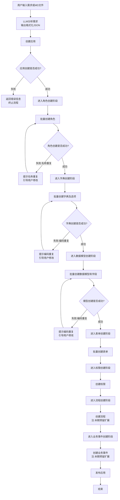
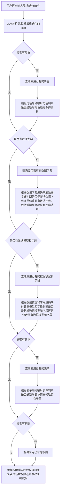
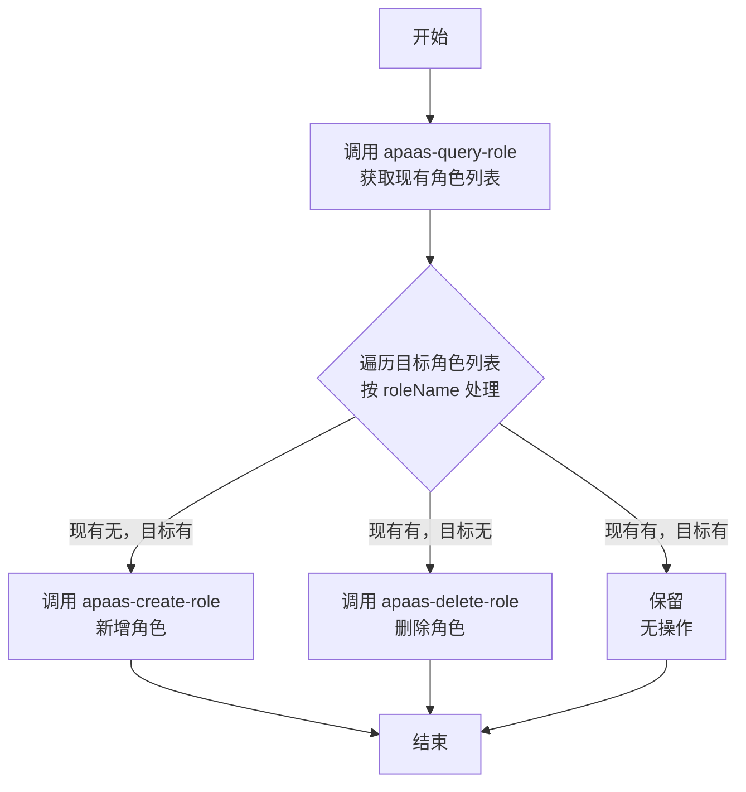
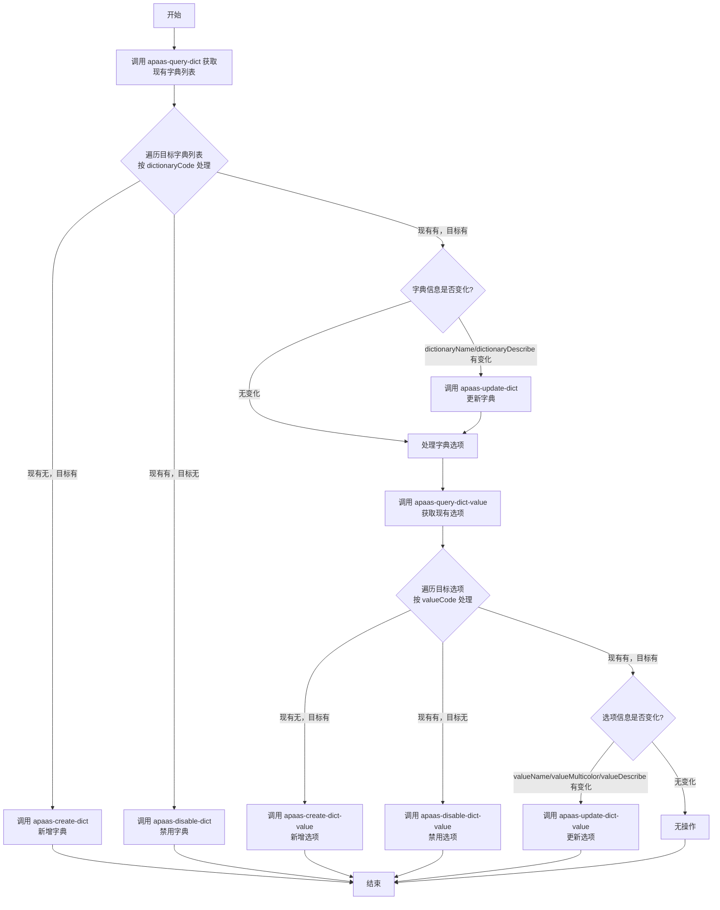
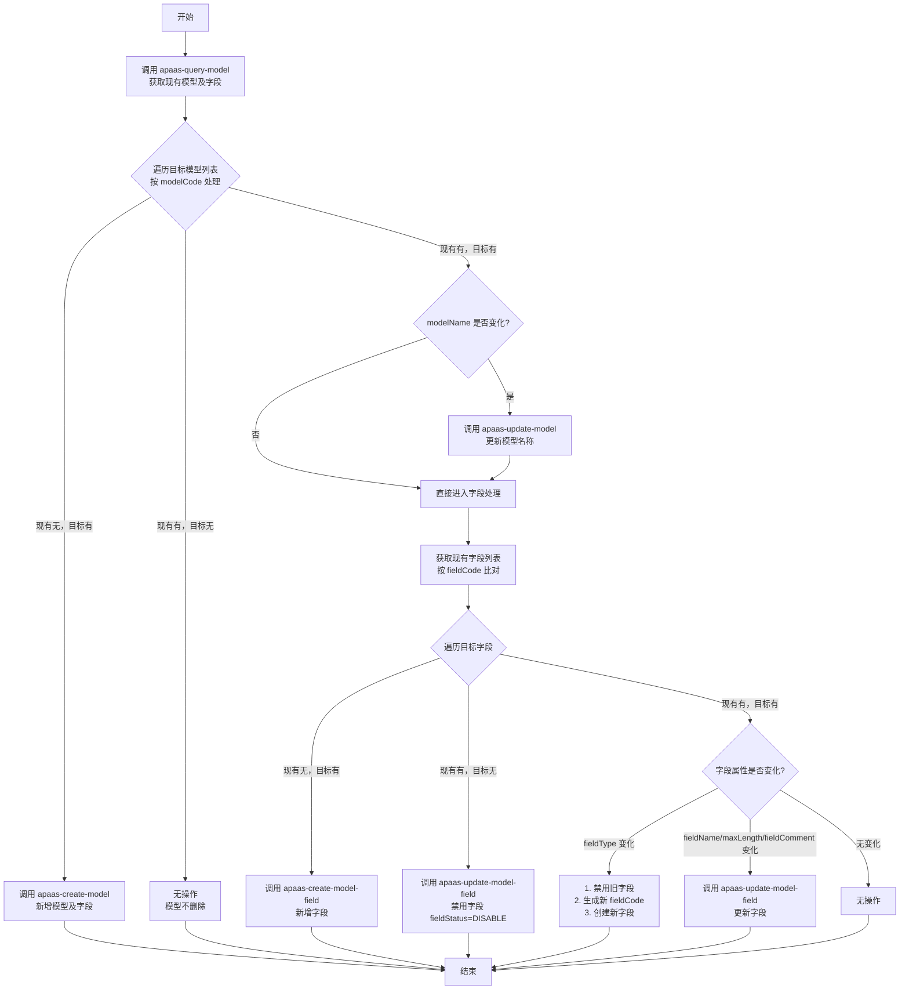
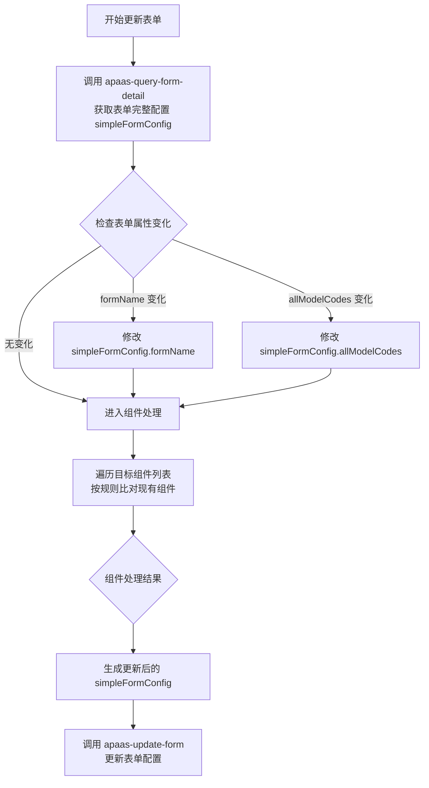
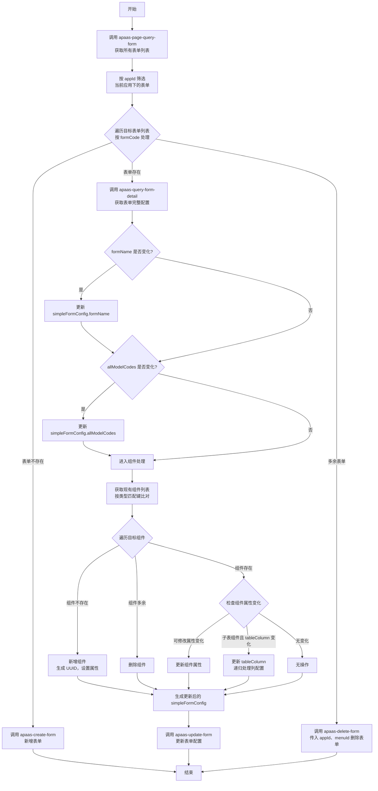

以下是优化后的结构化文档：

---

# 应用搭建设计文档

## 首次创建应用流程

### 一、整体流程图



---

### 二、首次创建应用 API 清单

#### 2.1 执行顺序与技能映射

| 阶段 | 操作 | 使用技能 | 说明 |
|------|------|---------|------|
| 1 | 创建应用 | `apaas-create-app` | 创建新应用实例 |
| 2 | 批量创建角色 | `apaas-create-role` | 创建角色列表 |
| 3 | 批量创建字典及选项 | `apaas-create-dict` | 创建数据字典及其选项 |
| 4 | 批量创建数据模型和字段 | `apaas-create-model` | 创建数据模型及字段定义 |
| 5 | 批量创建表单 | `apaas-create-form` | 创建表单配置 |
| 6 | 创建权限 | `apaas-create-permission` | 权限配置 |
| 7 | 创建流程 | — | 本期不做，预留扩展 |
| 8 | 创建业务事件 | — | 本期不做，预留扩展 |
| 9 | 发布应用 | `apaas-query-app`<br/>`apaas-deploy-app` | 查询版本号并递增发布 |

---

### 三、各阶段详细说明

#### 3.1 创建应用

| 项目 | 说明 |
|------|------|
| 使用技能 | `apaas-create-app` |
| 输入 | 应用配置信息（名称、编码、描述等） |
| 输出 | 应用ID |
| 失败处理 | 返回错误信息，终止流程 |

#### 3.2 批量创建角色

| 项目 | 说明 |
|------|------|
| 使用技能 | `apaas-create-role` |
| 输入 | 角色列表（roleName 等） |
| 输出 | 创建成功的角色列表 |
| 失败处理 | 角色名称重复时提示用户修改，支持重试 |

#### 3.3 批量创建字典及选项

| 项目 | 说明 |
|------|------|
| 使用技能 | `apaas-create-dict` |
| 输入 | 字典列表（dictionaryCode、dictionaryName、选项列表等） |
| 输出 | 创建成功的字典列表 |
| 失败处理 | 编码重复时提示用户修改，支持重试 |

#### 3.4 批量创建数据模型和字段

| 项目 | 说明 |
|------|------|
| 使用技能 | `apaas-create-model` |
| 输入 | 模型列表（modelCode、modelName、字段定义等） |
| 输出 | 创建成功的模型列表 |
| 失败处理 | 编码重复时提示用户修改，支持重试 |

#### 3.5 批量创建表单

| 项目 | 说明 |
|------|------|
| 使用技能 | `apaas-create-form` |
| 输入 | 表单配置列表 |
| 输出 | 创建成功的表单列表 |
| 失败处理 | 根据接口返回错误信息处理 |

#### 3.6 创建权限

| 项目 | 说明 |
|------|------|
| 使用技能 | `apaas-create-permission` |
| 输入 | 基于角色和表单配置权限 |

#### 3.7 创建流程（预留）

| 项目 | 说明 |
|------|------|
| 状态 | 本期不做，预留扩展接口 |
| 后续规划 | 支持工作流配置 |

#### 3.8 创建业务事件（预留）

| 项目 | 说明 |
|------|------|
| 状态 | 本期不做，预留扩展接口 |
| 后续规划 | 支持事件触发和自动化 |

#### 3.9 发布应用

| 项目 | 说明 |
|------|------|
| 使用技能 | `apaas-query-app`、`apaas-deploy-app` |
| 流程 | 1. 查询当前版本号<br/>2. 版本号递增<br/>3. 执行发布 |
| 输出 | 新版本号及发布结果 |

---

### 四、错误处理机制

| 错误类型 | 处理方式 | 可重试 |
|---------|---------|:-----:|
| 角色名称重复 | 提示修改后重试 | ✅ |
| 字典编码重复 | 提示修改后重试 | ✅ |
| 模型编码重复 | 提示修改后重试 | ✅ |
| 接口调用失败 | 返回错误信息，终止流程 | ❌ |
| 认证失败 | 检查 token，终止流程 | ❌ |

---

### 五、注意事项

1. **执行顺序依赖**
   - 角色创建必须在字典和模型之前
   - 表单创建依赖模型创建完成
   - 权限配置依赖角色和表单

2. **编码唯一性**
   - 应用编码、角色名称、字典编码、模型编码在租户内必须唯一
   - 创建前建议先查询确认是否存在

3. **扩展预留**
   - 流程和业务事件当前不做实现
   - 需要在代码中预留接口位置，便于后续接入

4. **版本管理**
   - 发布前必须查询当前版本号
   - 发布后版本号自动递增

---

## 更新应用资源的流程



### 判断是否更新还是新增资源的依据

- 角色：根据查询的角色名称判断是否是新增角色还是修改原有角色。如果对应上了角色名称不做任何操作，没有对应上的角色全部新增
- 数据字典：先根据查询的数据字典列表根据 dictionaryCode 判断是否已经有了对应的数据字典，没有则新增，否则做更新操作，更新的具体规则如下：
   - 字典名称(dictionaryName)变化
   - 字典描述(dictionaryDescribe)变化
   - 字典选项(dictionaryOptions)变化，根据 valueCode 判断是修改原有选项还是新增选项，如果之前有的选项现在没有了则需要禁用掉此选项
   - 字段选项值变化的依据为 选项名称(valueName)、标签颜色(valueMulticolor)、描述(valueDescribe)任意一个变化都需要做更新
- 数据模型和字段：先根据查询的数据模型列表根据 modelCode 判断是否已经有了对应的模型，没有则新增，否则做更新操作，更新的具体规则如下：
   - 模型名称(modelName)变化
   - 模型字段变化，根据 fieldCode 判断是修改原有字段还是新增字段，如果之前有的字段现在没有了则需要禁用掉此字段
   - 字段选项变化的依据为 名称(fieldName)、长度(maxLength)、注释(fieldComment)任意一个变化都需要做更新。如果一个字段只变化了类型是不合法的，类型不应轻易改变。当生成时如果类型不对，就弃用此字段重新创建一个字段。
- 表单：先根据查询的表单列表根据 formCode(这里的formCode就是创建表单allModelCodes中的第一个主表模型编码加上固定前缀 form_，完整的比对就是 form_ + 主表模型编码 === formCode) 判断是否已经有了对应的表单，如果已经有了表单，对表单做更新操作、否则新增表单。更新的具体规则如下具体见 `apaas-update-form` 技能

### 角色更新

#### 一、整体流程

```
1. 查询现有角色
   ↓
2. 按 roleName 比对
   ├── 仅现有 → 删除
   ├── 仅目标 → 新增
   └── 两者存在 → 保留（无操作）
```

---

#### 二、详细规则

##### 角色级操作

| 比对结果 | 操作 | 使用技能 | 说明 |
|---------|------|---------|------|
| 现有角色存在，目标角色不存在 | 删除角色 | `apaas-delete-role` | 移除不再使用的角色 |
| 现有角色不存在，目标角色存在 | 新增角色 | `apaas-create-role` | 创建缺失的目标角色 |
| 两者均存在 | 保留 | — | 角色名称唯一，创建后不可重名，仅支持名称修改 |

---

#### 三、完整决策树



---

#### 四、技能清单汇总

| 操作类型 | 技能名称 | 说明 |
|---------|---------|------|
| 查询角色列表 | `apaas-query-role` | 获取当前应用所有角色 |
| 新增角色 | `apaas-create-role` | 创建新的角色 |
| 删除角色 | `apaas-delete-role` | 删除不再使用的角色 |

---

#### 五、注意事项

1. **匹配键说明**
   - 以 `roleName` 为唯一匹配键进行比对

2. **角色名称唯一性**
   - 角色名称创建后不可重复
   - 仅支持修改角色名称，但需确保修改后仍保持唯一

3. **保留场景说明**
   - 当 `roleName` 同时存在于现有列表和目标列表时，不做任何处理
   - 如需修改角色名称，应在目标列表中体现为新名称，旧名称会被删除

---

### 字典及其选项更新

#### 一、整体流程

```
1. 查询现有字典
   ↓
2. 按 dictionaryCode 比对
   ├── 仅现有 → 删除
   ├── 仅目标 → 新增
   └── 两者存在 → 进入更新流程
```

---

#### 二、详细规则

##### 1. 字典级操作

| 比对结果 | 操作 | 使用技能 |
|---------|------|---------|
| 现有字典存在，目标字典不存在 | 禁用字典 | `apaas-disable-dict` |
| 现有字典不存在，目标字典存在 | 新增字典及其选项 | `apaas-create-dict` |
| 两者均存在 | 进入字典更新判断 | — |

---

##### 2. 字典级更新判断

当 `dictionaryCode` 两者均存在时：

| 判断条件 | 操作 | 使用技能 |
|---------|------|---------|
| `dictionaryName` 变化 | 更新字典后进入选项级处理 | `apaas-update-dict` |
| `dictionaryDescribe` 变化 | 更新字典后进入选项级处理 | `apaas-update-dict` |
| 均无变化 | 进入选项级处理 | — |

---

##### 3. 选项级处理

当字典无需更新或更新完成后，按以下流程处理选项：

```
3.1 查询现有选项 (apaas-query-dict-value)
   ↓
3.2 按 valueCode 比对
   ├── 仅目标存在 → 新增选项
   ├── 仅现有存在 → 禁用选项
   └── 两者存在 → 进入选项更新判断
```

###### 3.1 选项级操作明细

| 比对结果 | 操作 | 使用技能 |
|---------|------|---------|
| 目标选项存在，现有选项不存在 | 新增选项 | `apaas-create-dict-value` |
| 现有选项存在，目标选项不存在 | 禁用选项 | `apaas-disable-dict-value` |
| 两者均存在 | 进入选项更新判断 | — |

###### 3.2 选项更新判断

当 `valueCode` 两者均存在时：

| 判断条件 | 操作 | 使用技能 |
|---------|------|---------|
| `valueName` 变化 | 更新选项 | `apaas-update-dict-value` |
| `valueMulticolor` 变化 | 更新选项 | `apaas-update-dict-value` |
| `valueDescribe` 变化 | 更新选项 | `apaas-update-dict-value` |
| 均无变化 | 无操作 | — |

---

#### 三、完整决策树



---

#### 四、技能清单汇总

| 操作类型 | 技能名称 | 说明 |
|---------|---------|------|
| 查询字典列表 | `apaas-query-dict` | 获取当前应用所有数据字典 |
| 新增字典 | `apaas-create-dict` | 创建新的数据字典 |
| 更新字典 | `apaas-update-dict` | 更新字典名称或描述 |
| 禁用字典 | `apaas-disable-dict` | 禁用不再使用的字典 |
| 查询字典选项 | `apaas-query-dict-value` | 获取指定字典的所有选项 |
| 新增选项 | `apaas-create-dict-value` | 为字典添加新选项 |
| 更新选项 | `apaas-update-dict-value` | 更新选项的名称、标签颜色或描述 |
| 禁用选项 | `apaas-disable-dict-value` | 禁用不再使用的选项 |

---

#### 五、注意事项

1. **匹配键说明**
   - 字典级别：以 `dictionaryCode` 为唯一匹配键
   - 选项级别：以 `valueCode` 为唯一匹配键

2. **操作顺序**
   - 先处理字典级操作（新增/删除/更新）
   - 再处理选项级操作（新增/禁用/更新）

3. **查询字典选项**
   - 查询字典选项时需要提供 dictionaryId 参数，用于指定要查询的字典，值为查询数据字典中的 id 字段。

4. **无操作场景**
   - 字典和选项均无任何字段变化时，跳过所有更新操作

5. **字段变更检测**
   - 字典：`dictionaryName`、`dictionaryDescribe`
   - 选项：`valueName`、`valueMulticolor`、`valueDescribe`

---

### 数据模型和字段更新

#### 一、整体流程

```
1. 查询现有模型及字段
   ↓
2. 按 modelCode 比对
   ├── 仅目标 → 新增模型及字段
   ├── 两者存在 → 进入模型更新流程
   └── 仅现有 → 无操作（模型不建议删除，避免数据丢失）
```

---

#### 二、详细规则

##### 1. 模型级操作

| 比对结果 | 操作 | 使用技能 | 说明 |
|---------|------|---------|------|
| 现有模型不存在，目标模型存在 | 新增模型及字段 | `apaas-create-model` | 创建模型并同时创建其下所有字段 |
| 两者均存在 | 进入模型更新判断 | — | — |
| 现有模型存在，目标模型不存在 | 无操作 | — | 模型不建议删除，避免历史数据丢失 |

---

##### 2. 模型级更新判断

当 `modelCode` 两者均存在时：

| 判断条件 | 操作 | 使用技能 | 后续处理 |
|---------|------|---------|---------|
| `modelName` 变化 | 更新模型名称 | `apaas-update-model` | 更新后继续执行字段级处理 |
| `modelName` 无变化 | 直接进入字段级处理 | — | 无需更新模型名称 |

> **注意**：无论 `modelName` 是否变化，完成模型级处理后，都必须进入字段级处理。

---

##### 3. 字段级处理

```
3.1 获取目标字段列表
   ↓
3.2 按 fieldCode 比对现有字段
   ├── 仅目标存在 → 新增字段
   ├── 仅现有存在 → 禁用字段
   └── 两者存在 → 进入字段更新判断
```

###### 3.1 字段级操作明细

| 比对结果 | 操作 | 使用技能 | 说明 |
|---------|------|---------|------|
| 目标字段存在，现有字段不存在 | 新增字段 | `apaas-create-model-field` | 添加新字段 |
| 现有字段存在，目标字段不存在 | 禁用字段 | `apaas-update-model-field` | 设置 `fieldStatus = DISABLE` |
| 两者均存在 | 进入字段更新判断 | — | — |

###### 3.2 字段更新判断

当 `fieldCode` 两者均存在时：

| 判断条件 | 操作 | 使用技能 | 说明 |
|---------|------|---------|------|
| `fieldName` 变化 | 更新字段 | `apaas-update-model-field` | — |
| `maxLength` 变化 | 更新字段 | `apaas-update-model-field` | — |
| `fieldComment` 变化 | 更新字段 | `apaas-update-model-field` | — |
| `fieldType` 变化 | **禁用旧字段，新增新字段** | `apaas-update-model-field` + `apaas-create-model-field` | 类型变更不合规，新字段需使用新的 `fieldCode` |
| 均无变化 | 无操作 | — | — |

---

#### 三、字段类型变更特殊规则

> **重要原则**：
> 1. 字段类型一旦创建，不应轻易修改，类型变更可能导致数据兼容性问题
> 2. `fieldCode` 是字段的唯一标识，创建后不可修改，同一模型内不可重复

| 场景 | 处理方式 | 说明 |
|------|---------|------|
| 检测到 `fieldType` 变化 | 1. 调用 `apaas-update-model-field` 禁用旧字段（保留原 `fieldCode`）<br/>2. 生成新的 `fieldCode`（如在原编码后加 `_new` 或使用新命名）<br/>3. 调用 `apaas-create-model-field` 创建新字段<br/>4. 提示用户进行数据迁移 | 新旧字段编码不同，旧字段禁用，新字段正常工作 |
| 其他字段属性变化 | 直接调用 `apaas-update-model-field` 更新 | 保持原 `fieldCode` 不变 |

##### 字段类型变更示例

```
场景：字段 "user_name" 类型从 STRING 变更为 NUMBER

处理过程：
1. 现有字段：fieldCode = "user_name"，fieldType = STRING，fieldStatus = ENABLE
2. 检测到类型变化
3. 禁用旧字段：fieldStatus 更新为 DISABLE
4. 创建新字段：fieldCode = "user_name_new"，fieldType = NUMBER，fieldStatus = ENABLE
5. 提示用户：旧字段数据需手动迁移至新字段
```

---

#### 四、完整决策树



---

#### 五、技能清单汇总

| 操作类型 | 技能名称 | 说明 |
|---------|---------|------|
| 查询模型及字段 | `apaas-query-model` | 获取当前应用所有数据模型及其字段 |
| 新增模型 | `apaas-create-model` | 创建新模型，同时创建其下所有字段 |
| 更新模型名称 | `apaas-update-model` | 仅更新模型名称 |
| 新增字段 | `apaas-create-model-field` | 为指定模型添加新字段 |
| 更新字段 | `apaas-update-model-field` | 更新字段属性（名称、长度、注释、状态） |

---

#### 六、字段属性说明

| 字段属性 | 是否可更新 | 更新方式 | 说明 |
|---------|:--------:|---------|------|
| `fieldCode` | ❌ | — | 字段编码，创建后不可修改，同一模型内唯一 |
| `fieldName` | ✅ | 直接更新 | 字段显示名称 |
| `fieldType` | ❌ | **禁用+新增（新编码）** | 类型变更不合规，需重建并使用新编码 |
| `maxLength` | ✅ | 直接更新 | 字段长度限制 |
| `fieldComment` | ✅ | 直接更新 | 字段注释说明 |
| `fieldStatus` | ✅ | 直接更新 | 用于禁用字段 |

---

#### 七、注意事项

1. **模型名称更新与字段处理的关系**
   - 无论模型名称是否更新，完成后都必须进入字段级处理
   - 字段处理不依赖模型名称是否变更

2. **模型删除策略**
   - 模型不建议删除，避免历史数据丢失
   - 如需隐藏模型，可考虑其他方式（如权限控制）

3. **字段类型变更与编码唯一性**
   - `fieldType` 不允许直接修改
   - 检测到类型变化时，采用“禁用旧字段 + 新增新字段”策略
   - **新增字段时必须使用新的 `fieldCode`**，避免与旧字段编码重复
   - 新编码建议规则：`{原fieldCode}_new` 或 `{原fieldCode}_{版本号}`
   - 需提示用户进行数据迁移

4. **字段编码唯一性**
   - 同一模型内，`fieldCode` 必须唯一
   - 新增字段前必须确认编码未被使用

5. **操作顺序**
   - 先处理模型级更新
   - 再处理字段级新增/更新/禁用

6. **更新字段注意事项**
   - 更新字段时仅允许修改 `fieldName`、`maxLength`、`fieldComment`
   - 修改 `maxLength` 时需确保不影响已有数据

---

#### 八、更新流程示例

##### 示例1：模型名称变化 + 字段新增

```
场景：目标模型中 modelName 变化，同时有新增字段

执行流程：
1. 查询现有模型，发现 modelCode 匹配
2. 检测到 modelName 变化 → 调用 apaas-update-model 更新名称
3. 继续执行字段级处理：
   - 比对现有字段与目标字段
   - 发现新增字段 → 调用 apaas-create-model-field 创建
4. 完成所有操作
```

##### 示例2：字段类型变化

```
场景：字段 "age" 类型从 STRING 变更为 NUMBER

执行流程：
1. 检测到 fieldCode 匹配，但 fieldType 不一致
2. 禁用旧字段：调用 apaas-update-model-field，设置 fieldStatus = DISABLE
3. 生成新编码：将 "age" 改为 "age_new"
4. 创建新字段：调用 apaas-create-model-field，fieldCode = "age_new"，fieldType = NUMBER
5. 提示用户：需要将旧字段数据迁移至新字段
```
---

### 表单更新


#### 一、整体流程

```
1. 查询现有表单列表（按 appId 筛选）
   ↓
2. 按 formCode 比对
   ├── 仅目标 → 新增表单
   ├── 两者存在 → 进入表单更新流程
   └── 仅现有 → 删除表单
```

---

#### 二、详细规则

##### 1. 表单级操作

| 比对结果 | 操作 | 使用技能 | 说明 |
|---------|------|---------|------|
| 现有表单不存在，目标表单存在 | 新增表单 | `apaas-create-form` | 创建新表单及其组件配置 |
| 两者均存在 | 进入表单更新流程 | — | — |
| 现有表单存在，目标表单不存在 | 删除表单 | `apaas-delete-form` | 传入 `appId`、`menuId` 删除多余表单 |

---

##### 2. 表单更新流程



###### 2.1 表单属性更新

| 属性 | 判断条件 | 操作 | 说明 |
|------|---------|------|------|
| `formName` | 值发生变化 | 更新 `simpleFormConfig.formName` | 表单名称 |
| `allModelCodes` | 列表发生变化 | 更新 `simpleFormConfig.allModelCodes` | 关联模型编码列表 |

> **注意**：表单属性更新后，继续进入组件处理流程。

---

##### 3. 组件级处理

###### 3.1 组件匹配规则

| 组件类型 | 匹配键 | 说明 |
|---------|-------|------|
| `FORM_WIDGET_SON_TABLE` | `tableModelCode` | 子表组件，按子表模型编码匹配（仅用于匹配，不可修改） |
| 其他组件类型 | `modelField` | 普通组件，按绑定的模型字段匹配 |

###### 3.2 组件操作明细

| 比对结果 | 操作 | 说明 |
|---------|------|------|
| 目标组件存在，现有组件不存在 | 新增组件 | 在 `simpleFormConfig.formComponents` 中添加新组件 |
| 现有组件存在，目标组件不存在 | 删除组件 | 从 `simpleFormConfig.formComponents` 中删除对应组件 |
| 两者均存在 | 进入组件属性更新判断 | — |
| 均无变化 | 无操作 | — |

###### 3.3 组件属性更新判断

当组件匹配成功时，检查以下可修改属性：

| 属性 | 类型 | 说明 | 更新方式 |
|------|------|------|---------|
| `label` | string | 字段标签（显示名称） | 直接修改 |
| `placeholder` | string | 占位文本 | 直接修改 |
| `width` | integer | 宽度栅格（6=半行，12=整行） | 直接修改 |
| `height` | integer | 高度 | 直接修改 |
| `hidden` | boolean | 是否隐藏 | 直接修改 |
| `readOnly` | boolean | 是否只读 | 直接修改 |
| `required` | boolean | 是否必填 | 直接修改 |
| `uniqueCheck` | boolean | 是否唯一校验 | 直接修改 |
| `lengthLimit` | integer | 文本长度限制 | 直接修改 |
| `autoChangeLine` | boolean | 是否自动换行 | 直接修改 |

> **注意**：任一属性发生变化，都需要更新该组件。

---

##### 4. 不可修改属性

以下属性**禁止修改**，在同步过程中应保持原值不变：

| 属性 | 说明 |
|------|------|
| `uuid` | 组件唯一标识，不要修改 |
| `componentType` | 组件类型，不要修改 |
| `modelField` | 绑定的模型字段，不要修改 |
| `modelCode` | 所属模型编码，不要修改 |
| `tableModelCode` | 子表模型编码，仅用于匹配，不可修改 |
| `boId` | 业务对象 ID，不要修改 |
| `boCode` | 业务对象编码，不要修改 |

---

##### 5. 特殊组件处理规则

###### 5.1 子表组件（FORM_WIDGET_SON_TABLE）

子表组件仅使用 `tableModelCode` 进行匹配，**不可修改该属性**。需要处理子表列配置变化：

| 判断条件 | 操作 | 说明 |
|---------|------|------|
| `tableColumn` 变化 | 比对 `tableColumn` 列表，按相同规则处理新增、删除、修改列 | 子表列配置的同步逻辑与 `formComponents` 一致 |

> **注意**：
> - `tableModelCode` 仅用于匹配，**禁止修改**
> - 子表内部的列配置（`tableColumn`）需按组件级处理规则进行递归比对
> - 列配置中的组件属性同样遵循可修改/不可修改规则

###### 5.2 下拉选择组件绑定数据字典

当下拉选择组件需要绑定数据字典时，必须包含以下完整配置：

**必需属性结构：**

```json
{
  "chooseType": "SINGLE",                    // 下拉类型：SINGLE-单选，MULTI-多选
  "multicolor": false,                       // 是否支持标签颜色
  "source": {
    "type": "DICTIONARY_TYPE",               // 数据字典类型
    "id": "字典ID"                           // 数据字典的ID
  },
  "chooseOptions": [                         // 选项数组
    {
      "label": "选项标签",
      "id": "选项值",
      "status": "ENABLE",                    // ENABLE-启用，DISABLE-禁用
      "color": "#000000",                    // 标签颜色
      "labelI18nAssociated": false,          // 是否关联多语言
      "displayOrder": 0                      // 显示顺序
    }
  ],
  "dictionaryChooseOptions": []              // 与 chooseOptions 值相同，同步更新
}
```

**属性说明：**

| 属性 | 类型 | 必填 | 说明 |
|------|------|:---:|------|
| `chooseType` | string | 是 | 下拉类型：`SINGLE` / `MULTI` |
| `multicolor` | boolean | 是 | 是否支持标签颜色，默认 `false` |
| `source.type` | string | 是 | 固定值 `DICTIONARY_TYPE` |
| `source.id` | string | 是 | 数据字典ID |
| `chooseOptions` | array | 是 | 选项数组，与字典选项同步 |
| `dictionaryChooseOptions` | array | 是 | 与 `chooseOptions` 值相同 |

---

##### 6. 新增组件注意事项

| 序号 | 注意事项 | 说明 |
|:---:|---------|------|
| 1 | **生成唯一 UUID** | 使用 24 位十六进制字符串，确保全局唯一 |
| 2 | **正确设置 modelField** | 格式为 `{模型编码}.{字段编码}`，如 `user.name` |
| 3 | **验证模型字段存在性** | 新增组件前确认对应的模型字段已创建 |
| 4 | **参考现有组件结构** | 新组件应包含与现有组件一致的完整属性结构 |
| 5 | **设置默认值** | 为必填属性设置合理的默认值 |

---

#### 三、完整决策树



---

#### 四、技能清单汇总

| 操作类型 | 技能名称 | 说明 |
|---------|---------|------|
| 查询表单列表 | `apaas-page-query-form` | 获取平台所有表单列表 |
| 筛选应用表单 | — | 根据 `appId` 筛选当前应用下的表单 |
| 查询表单详情 | `apaas-query-form-detail` | 获取表单完整配置（含组件） |
| 新增表单 | `apaas-create-form` | 创建新表单 |
| 更新表单 | `apaas-update-form` | 更新表单配置 |
| 删除表单 | `apaas-delete-form` | 删除多余表单，需传入 `appId`、`menuId` |

---

#### 五、组件匹配规则汇总

| 组件类型 | 匹配键 | 是否可修改 | 说明 |
|---------|-------|:--------:|------|
| `FORM_WIDGET_SON_TABLE` | `tableModelCode` | ❌ | 仅用于匹配，不可修改 |
| 其他所有组件 | `modelField` | ❌ | 仅用于匹配，不可修改 |

---

#### 六、注意事项

1. **表单查询与筛选**
   - 先调用 `apaas-page-query-form` 获取所有表单
   - 根据 `appId` 筛选出当前应用下的表单进行比对

2. **表单新增与删除**
   - 新增：调用 `apaas-create-form`
   - 删除：调用 `apaas-delete-form`，需传入 `appId` 和 `menuId`

3. **表单属性更新顺序**
   - 先更新 `formName` 和 `allModelCodes`
   - 再处理组件级变更

4. **组件匹配键不可修改**
   - 所有组件的匹配键（`modelField`、`tableModelCode`）仅用于识别组件，**禁止修改**
   - 子表组件的 `tableModelCode` 同样不可修改

5. **不可修改属性保护**
   - `uuid`、`componentType`、`modelField`、`tableModelCode` 等属性禁止修改
   - 同步时需保留原值

6. **新增组件要求**
   - 必须生成唯一 24 位十六进制 UUID
   - `modelField` 格式必须正确且对应字段已存在
   - 参考现有组件补充完整属性

7. **子表组件特殊处理**
   - `tableModelCode` 仅用于匹配，**不可修改**
   - `tableColumn` 列配置需按组件级规则递归比对
   - 支持列的增、删、改操作

8. **数据字典绑定**
   - 下拉组件绑定字典时，`source.type` 必须为 `DICTIONARY_TYPE`
   - `chooseOptions` 和 `dictionaryChooseOptions` 保持同步

---

#### 七、更新流程示例

##### 示例1：新增表单

```
场景：目标表单在现有列表中不存在

执行流程：
1. 调用 apaas-page-query-form 获取所有表单
2. 按 appId 筛选当前应用下的表单
3. 按 formCode 比对，发现目标表单不存在
4. 调用 apaas-create-form 新增表单及组件配置
```

##### 示例2：更新表单（名称变化 + 组件新增）

```
场景：目标表单 formName 变化，同时有新增组件

执行流程：
1. 查询现有表单，发现 formCode 匹配
2. 调用 apaas-query-form-detail 获取完整配置
3. 检测到 formName 变化 → 更新 simpleFormConfig.formName
4. 进入组件处理：
   - 比对现有组件与目标组件
   - 发现新增组件 → 生成 UUID，设置属性，添加到 formComponents
5. 调用 apaas-update-form 更新表单
```

##### 示例3：更新子表组件（tableColumn 变化）

```
场景：子表组件的列配置发生变化

执行流程：
1. 查询现有表单，获取完整配置
2. 进入组件处理，按 tableModelCode 匹配到子表组件
3. 检测到 tableColumn 列表变化（注意：tableModelCode 不可修改）
4. 按组件级规则比对 tableColumn：
   - 新增列 → 添加
   - 删除列 → 移除
   - 列属性变化 → 更新
5. 更新组件的 tableColumn 配置
6. 调用 apaas-update-form 更新表单
```

##### 示例4：删除多余表单

```
场景：现有表单在目标列表中不存在

执行流程：
1. 调用 apaas-page-query-form 获取所有表单
2. 按 appId 筛选当前应用下的表单
3. 按 formCode 比对，发现现有表单不在目标列表中
4. 获取表单的 appId 和 menuId
5. 调用 apaas-delete-form 删除表单
```

---