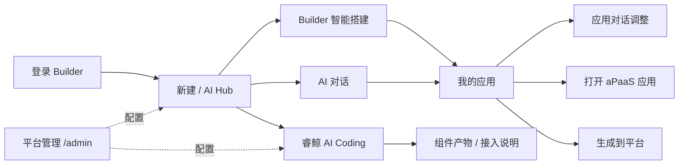

# AI Builder 最新设计稿

日期：2026-05-18
适用项目：`apaas-builder-mcp-server` 内置 Builder 前端 + MCP 服务 + 现有平台管理后台

## 设计结论

新版产品不是纯 Vibe Coding，也不是把 `apaas-builder-ai` 原 redesign 包完整搬过来。最终边界如下：

- Builder 前台：负责智能搭建、应用管理、AI 对话、SPEC 生成、部署到 aPaaS。
- 睿鲸 AI Coding：负责平台二开产物生成，用户通过对话描述需求，AI 生成组件、页面、接口或脚本。
- MCP 服务：保留在当前服务内，由后端暴露工具能力，管理和测试走现有管理后台。
- 平台管理：成员、租户、平台环境、模型配置、MCP 接入、测试、日志统一走现有 `/admin`。
- 不暴露纯 Vibe Coding 工作台入口，不做独立 code-server 式全代码 IDE 产品面。

一句话版本：**业务用户在 Builder 里完成“想法到上线应用”，管理员在平台管理里配置环境和模型，开发扩展只走睿鲸 AI Coding。**

## 信息架构

Builder 前台只保留和业务搭建相关的入口。



### Builder 前台导航

左侧竖向导航使用窄 rail，默认展示图标，hover 显示 tooltip。

| 入口 | 路由 | 说明 |
| --- | --- | --- |
| 首页 | `/` | AI Hub，新建入口 |
| 应用 | `/apps` | 我的应用列表，继续搭建、部署、打开平台 |
| AI 对话 | `/ai-chat` | 需求梳理、文档整合、材料上传 |
| AI 伴侣 | `/ai-copilot` | 有 Dolphin 配置时显示 |
| AI 编码 | `/coding` | 睿鲸 AI Coding，平台二开 |

### 不在 Builder 前台显示的入口

| 原入口 | 最新处理 |
| --- | --- |
| Vibe Coding | 移除入口，旧链接重定向到 `/coding` |
| 沙箱监控 | 不在 Builder 前台显示 |
| DevOps | 不在 Builder 前台显示 |
| 成员管理 | 走 `/admin/users` |
| 平台环境 | 走 `/admin/envs` |
| 模型配置 | 走 `/admin/llm-configs` |
| 租户管理 | 走 `/admin/tenants` |
| MCP 管理 | 走现有平台管理模块 |

## 视觉语言

整体是安静的产品后台，不做营销页，不做大面积装饰。

### 色彩

主色采用 indigo-violet，AI 辅助色采用 cyan。页面不使用大面积单一紫色背景，避免“全屏紫蓝渐变”。

| Token | 值 | 用途 |
| --- | --- | --- |
| `--brand-50` | `#F2F0FE` | 选中底、轻提示 |
| `--brand-500` | `#5B5BD6` | 主按钮、当前导航 |
| `--brand-700` | `#38379E` | 强调文字 |
| `--ai-50` | `#ECF8FB` | AI 提示轻底 |
| `--ai-500` | `#1D89A8` | AI 徽标、AI 流程节点 |
| `--surface` | `#FFFFFF` | 面板 |
| `--bg-base` | `#F4F2F9` | 应用背景 |
| `--text` | `#18152E` | 主文字 |
| `--text-2` | `#4F4A6E` | 次级文字 |

状态色：

- 成功 / 已连接：`#10A37F`
- 警告 / 草稿：`#D97706`
- 错误 / 危险：`#DC2626`
- 信息：`#0284C7`

### 字体与密度

- 字体：`Inter`, `PingFang SC`, system-ui
- 页面标题：22px / 600
- 卡片标题：15px / 600
- 正文：14px / 1.55
- 辅助信息：12px-13px
- 代码和标识：`JetBrains Mono`, `SF Mono`, `Menlo`

### 组件规则

- 卡片圆角 8-12px，不做大圆角胶囊风。
- 页面区域不套大卡片，只有列表项、表单、弹窗使用卡片。
- 图标优先使用 Element Plus 图标，按钮内图标 + 文案。
- 主流程按钮每屏只保留一个明显主按钮。
- 命令面板、弹窗、下拉浮层使用轻阴影和白底，不使用重玻璃拟态。
- 所有 icon-only 按钮必须有 `title` 或 `aria-label`。

## 核心页面设计

### 1. 登录页

目标：明确这是 Builder 智能搭建入口，同时告诉用户管理配置走后台。

布局：

- 左侧品牌说明：
  - Builder 智能搭建：一句话生成可上线应用
  - SPEC 自动梳理角色、模型、表单和流程
  - 自开发边界清晰交给睿鲸 AI Coding
  - 平台成员、环境和模型统一走管理后台
- 右侧登录表单：
  - 用户名
  - 密码
  - 登录按钮
  - 账号由管理员统一创建

不展示：

- Vibe Coding
- 独立全代码工作区
- 管理后台入口按钮

### 2. 首页 / AI Hub

目标：把用户带到正确工作流，不让用户先理解复杂模块。

首屏结构：

```text
顶部：面包屑 / 租户 / 搜索 / 新增应用

中间：
  AI 标识
  标题：把想法和材料交给 AI，生成可上线的 aPaaS 应用
  副标题：支持材料上传、需求澄清、SPEC 生成、平台部署

  模式切换：
    AI 对话      需求梳理 / 文档整合
    Builder      标准设计文档生成 SPEC
    睿鲸 AI Coding 平台二开

  输入区：
    多行输入
    附件按钮
    引用应用
    文档模板
    主 CTA

下方：
  最近应用
  当前租户概览
```

模式说明：

| 模式 | CTA | 去向 |
| --- | --- | --- |
| AI 对话 | 开始聊需求 | `/ai-chat` |
| Builder | 选择标准文档 | `/chat?from=upload` |
| 睿鲸 AI Coding | 进入 AI Coding | `/coding` |

首页不再出现“导入 Git 仓库”或“打开 Vibe Coding”。

### 3. 应用列表

目标：作为“继续工作”的主入口。

核心信息：

- 应用名称、编码、更新时间
- 阶段：草稿 / SPEC / 可部署 / 已上线
- 生成进度
- 最近对话
- 模型、表单、流程、角色数量

操作：

- AI 调整
- 生成到平台
- 在平台中打开
- 应用成员弹窗
- 删除

列表优先，卡片视图作为辅助。企业后台场景默认需要更强扫描效率。

### 4. AI 对话

目标：把材料、口述需求、上下文整理为标准设计文档。

布局：

- 左侧：会话列表
- 中间：对话流
- 右侧：文档/应用上下文预览

关键交互：

- 支持上传 PDF / Word / Excel / 图片 / Markdown
- AI 追问边界、角色、流程、字段
- 输出标准设计文档
- 一键送入 Builder 解析

### 5. Builder 智能搭建

目标：从标准设计文档生成 SPEC，再部署到 aPaaS。

布局：

- 左侧：应用上下文和历史对话
- 中间：对话与生成过程
- 右侧：SPEC 结构化预览

SPEC 区块：

- 角色
- 模型
- 表单
- 流程
- 字典
- 权限

部署弹窗：

1. 选择平台环境
2. 查看变更影响
3. 确认生成到平台

平台环境数据来自 `/admin/envs` 配置，不在 Builder 内重复管理。

### 6. 睿鲸 AI Coding

目标：面向平台二开，不要求用户手写代码。

产品定位：

- 用户描述组件、页面、接口或脚本
- AI 拆任务、生成文件、运行校验
- 产出 UMD 包、接入说明、发布到组件市场

布局：

```text
左侧：AI Coding 工作区列表
中间：任务进度 + 对话
右侧：产物清单 + 接入说明
```

右侧产物区不做“完整 IDE”，而是：

- 文件清单
- diff 摘要
- 构建日志
- UMD 体积
- 接入步骤
- 发布按钮

禁止文案：

- “真编辑代码”
- “打开全代码 IDE”
- “Vibe Coding”

### 7. 平台管理后台

平台管理不改成 Builder 子页面，继续使用现有 `/admin`。

需要包含：

- 系统状态
- MCP 服务
- MCP 测试
- 平台环境
- LLM 配置
- 租户
- 用户
- 日志或接入状态

Builder 前台跳转到后台时使用整页跳转，避免两个 SPA 路由互相吞路径。

## 顶栏与命令面板

### 顶栏

保留：

- 面包屑
- 当前租户
- 全局搜索
- 页面操作区

搜索 placeholder：

`搜索应用、对话、设计文档...`

不写：

- 搜索仓库
- 搜索模型配置
- 搜索沙箱

### Cmd+K

分组：

- 导航：首页、我的应用、AI 对话、AI Coding
- 快捷操作：新建应用、上传设计文档、继续最近对话
- 最近：最近应用、最近会话

不包含：

- Vibe Coding
- 沙箱监控
- DevOps
- 成员管理
- 平台环境
- 模型配置

## 路由方案

| 路由 | 页面 | 状态 |
| --- | --- | --- |
| `/login` | 登录 | 保留 |
| `/` | 首页 AI Hub | 保留 |
| `/apps` | 我的应用 | 保留 |
| `/apps/:id/platform` | aPaaS iframe | 保留 |
| `/ai-chat/:id?` | AI 对话 | 保留 |
| `/ai-copilot` | AI 伴侣 | 条件显示 |
| `/chat/:id?` | Builder 搭建对话 | 保留 |
| `/coding` | 睿鲸 AI Coding | 保留 |
| `/marketplace` | 组件市场 | 可保留，入口从 Coding 产物区进入 |
| `/vibe-coding*` | 老链接 | 重定向 `/coding` |
| `/online-coding*` | 老链接 | 重定向 `/coding` |
| `/platform-envs` | 老链接 | 跳 `/admin/envs` 或 `/admin/llm-configs` |
| `/tenant-users` | 老链接 | 跳 `/admin/users` |
| `/admin/tenants` | 老链接 | 跳 `/admin/tenants` |

## 后端与 MCP 边界

保留当前 FastAPI 服务里的 MCP 能力：

- `/api/mcp/*`
- `/api/mcp-platform/*`
- `/api/mcp-tools/*`
- 已有 Builder API

前台只消费业务 API，不提供 MCP 管理表单。MCP 管理、测试和日志由 admin-spa 承接。

## 响应式策略

桌面优先，但不能破坏移动访问。

- 1280px 以上：左 rail + 顶栏 + 主区域
- 768-1279px：rail 保持图标模式，主区域减少右侧辅助面板
- 767px 以下：rail 变底部或抽屉，卡片/列表单列，按钮保持 44px 触控高度

文本不能用 viewport 缩放字号。长标题优先换行，按钮文案过长时使用短标签 + tooltip。

## 落地优先级

### P0：已经确定的产品边界

- 移除 Builder 前台 Vibe Coding 可见入口
- 旧 Vibe/online-coding 链接重定向到 `/coding`
- 管理类入口走 `/admin`
- 登录页去掉全代码工作区文案

### P1：统一视觉

- 整理 `theme-vars.css` token
- 让 `BuilderNavRail`、`BuilderTopBar`、`BuilderCommandPalette` 使用统一 indigo-violet + AI cyan
- 首页三模式文案改为 AI 对话 / Builder / 睿鲸 AI Coding
- 搜索文案去掉仓库、模型等管理类对象

### P2：核心体验

- 应用列表强化为主工作入口
- AI 对话输出标准设计文档后可直接送 Builder
- Builder 对话页右侧 SPEC 结构化预览更稳定
- 睿鲸 AI Coding 右侧产物区改为文件清单 + 接入说明

### P3：管理后台对齐

- admin-spa 补齐平台环境、LLM 配置、MCP 测试入口
- Builder 到 admin 的跳转路径统一封装
- 后台登录态和 Builder 登录态保持一致

## 验收标准

- Builder 前台页面中搜索不到 “Vibe Coding”。
- Builder 前台页面中不出现“沙箱监控”“DevOps”“模型配置”“平台环境”“租户管理”等独立入口。
- 管理能力能从 `/admin` 完成。
- 用户在首页能明确选择：聊需求、上传标准文档、做平台二开。
- 睿鲸 AI Coding 页面没有完整 IDE 暗示，主视觉是对话、进度、产物。
- 前端构建通过，旧链接不 404。
